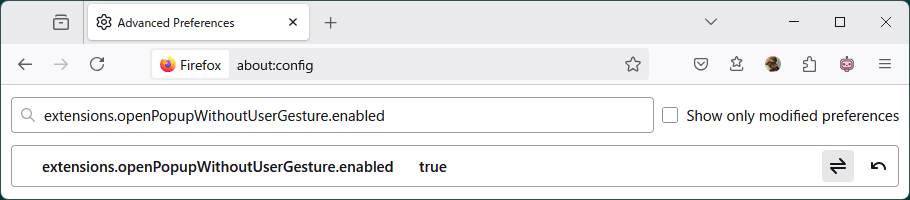
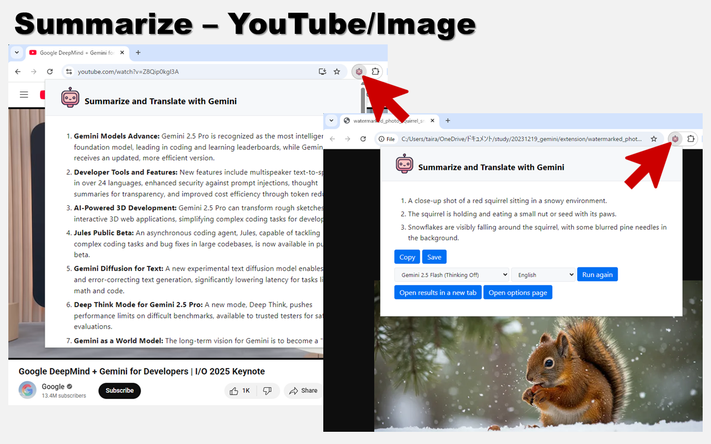

# extension-summarize-translate-gemini

Chrome extension to summarize and translate web pages. Uses Gemini as the backend.

## FAQ

### Pop-up windows are not appearing from the context menus in Firefox

To open a popup from the context menu in Firefox, set `extensions.openPopupWithoutUserGesture.enabled` to true in `about:config`.

This is being tracked as Firefox [Bug 1799344](https://bugzilla.mozilla.org/show_bug.cgi?id=1799344).

## Setup

This extension can be installed from [Chrome Web Store](https://chromewebstore.google.com/detail/hmdcbbbdmfapkpdaganadiihfmdnpngi), [Microsoft Edge Add-ons](https://microsoftedge.microsoft.com/addons/detail/ljmmilamifhanifgbfliknbicfjllheb), or [Firefox Add-ons](https://addons.mozilla.org/firefox/addon/summarize-translate-gemini/).
The following are instructions for manual installation, for development purposes.

1. Open 'Manage Extensions' page in Google Chrome browser.
2. Enable 'Developer mode'.
3. Click 'Load unpacked' and select `extension` directory.
4. Open 'Options' page and register the Gemini API Key, then select the language.

You can obtain a Gemini API Key from [Google AI Studio](https://aistudio.google.com).
This extension uses Gemini 2.5 Flash by default.

## Usage

### Summarize

Simply open a web page and click on the extension icon to summarize its content.

If a YouTube video has captions, this extension will summarize the captions.
Also, if you open an image file or a PDF file, this extension will summarize the currently displayed image.

### Translate

Select the text you want to translate and click on the extension icon.

### Results

Follow-up questions can be asked on the results page.

## License

MIT License  
Copyright (c) 2024-2025 Sadao Hiratsuka
