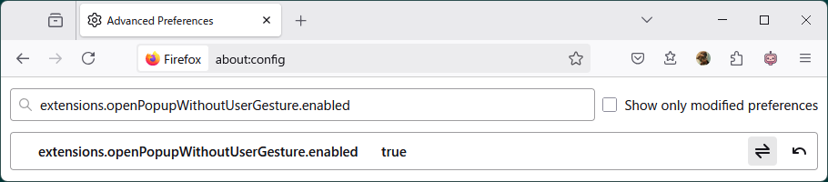
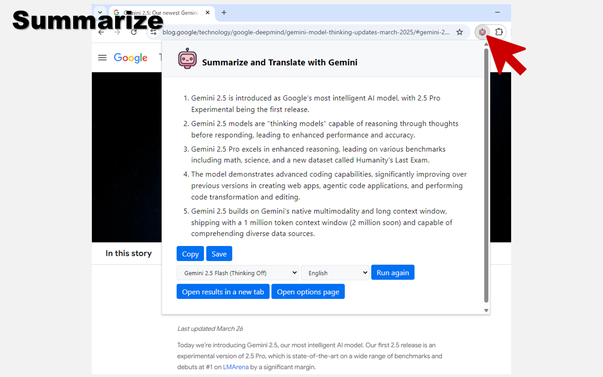
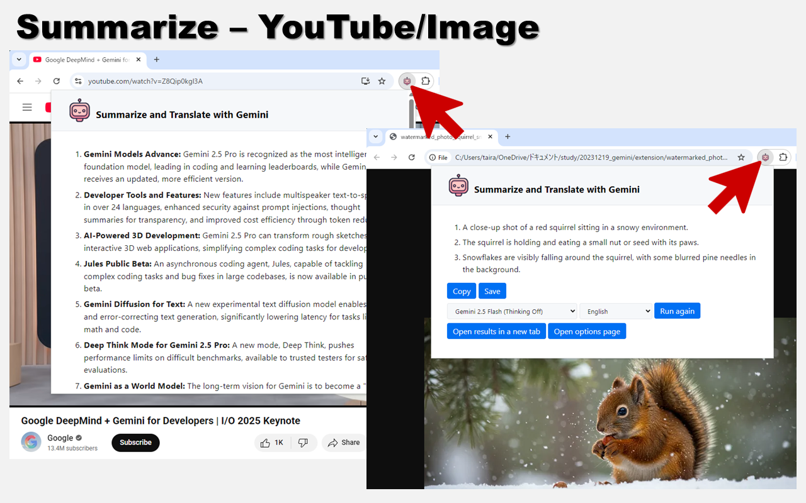
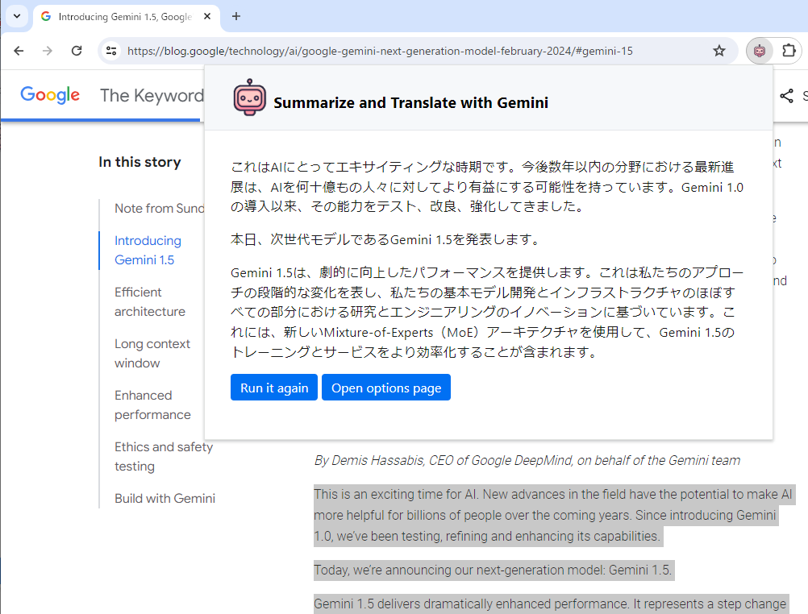
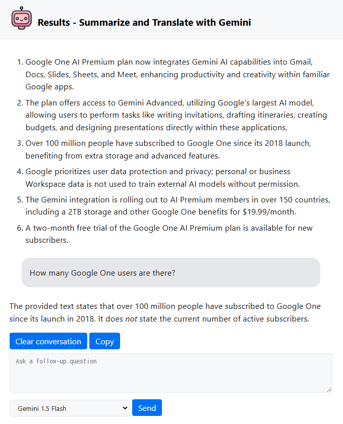

# extension-summarize-translate-gemini

Chrome extension to summarize and translate web pages. Uses Gemini or an OpenAI-compatible API as the backend.

## FAQ

### Pop-up windows are not appearing from the context menus in Firefox

To open a popup from the context menu in Firefox, set `extensions.openPopupWithoutUserGesture.enabled` to true in `about:config`.

This issue was tracked as Firefox [Bug 1799344](https://bugzilla.mozilla.org/show_bug.cgi?id=1799344) and was fixed in Firefox 149.

### What is Auto-fallback?

The Gemini API Free Tier has strict [rate limits](https://ai.google.dev/gemini-api/docs/rate-limits). The Auto-fallback feature automatically tries alternative models when the current model hits its rate limit (HTTP 429 error).

When you select **"Gemini Flash with Gemma Fallback"** in the options, the extension will try models in this priority order:

1. Gemini 3 Flash Preview (Thinking Minimal)
2. Gemini 2.5 Flash (Thinking Off)
3. Gemini 3.1 Flash-Lite Preview (Thinking Minimal)
4. Gemini 2.5 Flash-Lite (Thinking Off)
5. Gemma 4 31B (Thinking Minimal)
6. Gemma 3 27B

Gemma models have more relaxed rate limits, so they serve as the final fallback option to ensure the extension remains functional even under heavy usage.

### How do I set up an OpenAI-compatible Base URL?

Enter the API root URL in `Base URL`. In most cases, this is the URL ending in `.../v1`.
Do not enter a specific endpoint such as `/chat/completions`, because the extension appends the endpoint path automatically.

Confirmed examples:

| Service | Base URL |
| --- | --- |
| OpenAI | `https://api.openai.com/v1` |
| OpenCode Go | `https://opencode.ai/zen/go/v1` |

After you enter a `Base URL` and click `Save`, the browser may ask you to grant this extension permission to access that API origin.
This is expected. You enter a normal `Base URL` such as `https://api.openai.com/v1`, and the extension requests permission only for that API origin.

If you import settings from a file or restore them from cloud sync, the `Base URL` may be filled in without showing the permission dialog.
If that API origin has not yet been approved in your browser, click `Save` once to request permission.

Even when the `Base URL` is correct, a service may still not work if its API is not fully OpenAI-compatible or if it blocks cross-origin requests from browser extensions.

## Setup

This extension can be installed from [Chrome Web Store](https://chromewebstore.google.com/detail/hmdcbbbdmfapkpdaganadiihfmdnpngi), [Microsoft Edge Add-ons](https://microsoftedge.microsoft.com/addons/detail/ljmmilamifhanifgbfliknbicfjllheb), or [Firefox Add-ons](https://addons.mozilla.org/firefox/addon/summarize-translate-gemini/).
The following are instructions for manual installation, for development purposes.

1. Open 'Manage Extensions' page in Google Chrome browser.
2. Enable 'Developer mode'.
3. Click 'Load unpacked' and select `extension` directory.
4. Open 'Options' page and register the Gemini API Key, then select the language.

You can obtain a Gemini API Key from [Google AI Studio](https://aistudio.google.com).
This extension uses Gemini 3.1 Flash-Lite Preview by default.

## Usage

### Summarize

Simply open a web page and click on the extension icon to summarize its content.

If a YouTube video has captions, this extension will summarize the captions.
Also, if you open an image file or a PDF file, this extension will summarize the currently displayed image.

### Translate

Select the text you want to translate and click on the extension icon.

### Results

Follow-up questions can be asked on the results page.

## License

MIT License  
Copyright (c) 2024-2026 Sadao Hiratsuka
