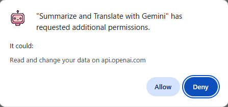

# extension-summarize-translate-gemini

Chrome extension to summarize and translate web pages. Uses Gemini or an OpenAI-compatible API as the backend.

## FAQ

### Pop-up windows are not appearing from the context menus in Firefox

To open a popup from the context menu in Firefox, set `extensions.openPopupWithoutUserGesture.enabled` to true in `about:config`.

This issue was tracked as Firefox [Bug 1799344](https://bugzilla.mozilla.org/show_bug.cgi?id=1799344) and was fixed in Firefox 149.

### What is Auto-fallback?

The Gemini API Free Tier has strict [rate limits](https://ai.google.dev/gemini-api/docs/rate-limits). The Auto-fallback feature automatically tries alternative models when the current model hits its rate limit (HTTP 429 error).

When you select **"Gemini Flash with Gemma Fallback"** in the options, the extension will try models in this priority order:

1. Gemini 3 Flash Preview (Thinking Minimal)
2. Gemini 2.5 Flash (Thinking Off)
3. Gemini 3.1 Flash-Lite Preview (Thinking Minimal)
4. Gemini 2.5 Flash-Lite (Thinking Off)
5. Gemma 4 31B (Thinking Minimal)
6. Gemma 3 27B

Gemma models have more relaxed rate limits, so they serve as the final fallback option to ensure the extension remains functional even under heavy usage.

### How do I set up an OpenAI-compatible Base URL?

Enter the API root URL in `Base URL`. In most cases, this is the URL ending in `.../v1`.
Do not enter a specific endpoint such as `/chat/completions`, because the extension appends the endpoint path automatically.

Confirmed examples:

| Service | Base URL |
| --- | --- |
| OpenAI | `https://api.openai.com/v1` |
| Azure OpenAI | `https://YOUR-RESOURCE-NAME.openai.azure.com/openai/v1` |
| OpenRouter | `https://openrouter.ai/api/v1` |
| OpenCode Go | `https://opencode.ai/zen/go/v1` |
| Ollama | `http://YOUR-HOST:11434/v1` |

After you enter a `Base URL` and click `Save`, the browser may ask you to grant the extension permission to access that API origin.
This is expected. You enter a normal `Base URL` such as `https://api.openai.com/v1`, and the extension requests permission only for that API origin.

If you import settings from a file or restore them from cloud sync, the `Base URL` may be filled in without showing the permission dialog.
If that API origin has not yet been approved in your browser, click `Save` once to request permission.

Even when the `Base URL` is correct, a service may still not work if its API is not fully OpenAI-compatible or if it blocks cross-origin requests from browser extensions.

#### Note on Ollama

Ollama binds to `127.0.0.1:11434` by default. If the server runs on a different host or port, set the `OLLAMA_HOST` environment variable (e.g. `OLLAMA_HOST="0.0.0.0:11434"`).

Browser extensions have their own origin scheme (e.g. `chrome-extension://...`), so requests to Ollama are cross-origin even on the same machine. By default, Ollama only allows requests from `127.0.0.1` and `0.0.0.0`. Set `OLLAMA_ORIGINS` to include the extension origins (e.g. `OLLAMA_ORIGINS="chrome-extension://*,moz-extension://*"`).

See the [Ollama FAQ](https://docs.ollama.com/faq) for more details.

### What are Reasoning effort and Thinking type?

When the API provider is set to OpenAI-compatible, the options page shows two additional settings that control reasoning behavior. If either setting is left as `Unspecified`, the extension omits that parameter and lets the API use its default behavior.

| Setting | API parameter | Values |
| --- | --- | --- |
| Reasoning effort | `reasoning_effort` | `xhigh`, `high`, `medium`, `low`, `none` |
| Thinking type | `thinking.type` | `enabled`, `disabled` |

`thinking.type` is sent as a nested object: `"thinking": { "type": "..." }`.

#### Model compatibility

Support depends on the model.

| Model | `reasoning_effort` | `thinking.type` | Notes |
| --- | --- | --- | --- |
| OpenAI GPT‑5.5 / 5.4 | Supported | Not supported — returns an error | — |
| DeepSeek V4 Pro / Flash | Supported (except `none`) | Supported | If `thinking.type` is set to `disabled`, `reasoning_effort` must remain `Unspecified`. |

If you choose an unsupported combination, the API may return an error. In that case, set the unsupported option back to `Unspecified` and save again.

#### Suggested starting points

Lightweight models with minimal reasoning give good quality for summarization and translation while responding noticeably faster. Try these first:

| Provider | Model ID | `reasoning_effort` | `thinking.type` |
| --- | --- | --- | --- |
| OpenAI | `gpt-5.4-nano` | `none` | Unspecified |
| DeepSeek | `deepseek-v4-flash` | Unspecified | `disabled` |

## Setup

This extension is available on the [Chrome Web Store](https://chromewebstore.google.com/detail/hmdcbbbdmfapkpdaganadiihfmdnpngi), [Microsoft Edge Add-ons](https://microsoftedge.microsoft.com/addons/detail/ljmmilamifhanifgbfliknbicfjllheb), and [Firefox Add-ons](https://addons.mozilla.org/firefox/addon/summarize-translate-gemini/).
The following are instructions for manual installation, for development purposes.

1. Open the Manage Extensions page in Google Chrome.
2. Enable Developer mode.
3. Click Load unpacked and select the `extension` directory.
4. Open the Options page, register your Gemini API key, and select a language.

You can obtain a Gemini API key from [Google AI Studio](https://aistudio.google.com).
This extension uses Gemini 3.1 Flash-Lite Preview by default.

## Usage

### Summarize

Simply open a web page and click the extension icon to summarize its content.

If a YouTube video has captions, this extension will summarize the captions.
When you open an image file or a PDF, the extension summarizes the currently displayed image.

### Translate

Select the text you want to translate and click the extension icon.

### Results

You can ask follow-up questions on the results page.

## License

MIT License  
Copyright (c) 2024-2026 Sadao Hiratsuka
