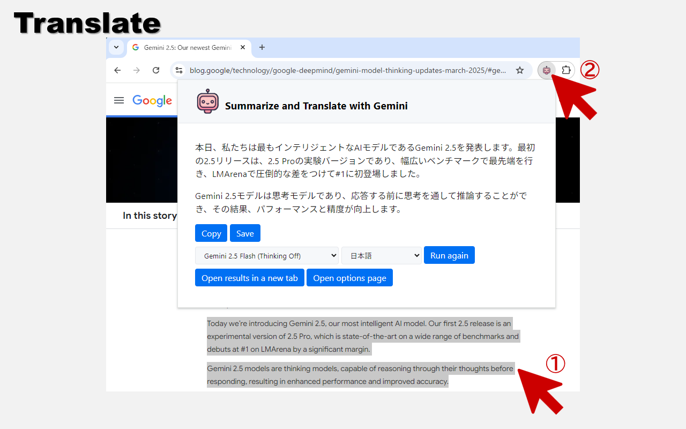

# extension-summarize-translate-gemini

Chrome extension to summarize and translate web pages. Uses Gemini as the backend.

## Setup

This extension can be installed from [Chrome Web Store](https://chromewebstore.google.com/detail/hmdcbbbdmfapkpdaganadiihfmdnpngi) or [Microsoft Edge Add-ons](https://microsoftedge.microsoft.com/addons/detail/ljmmilamifhanifgbfliknbicfjllheb).
The following are instructions for manual installation, for development purposes.

1. Open 'Manage Extensions' page in Google Chrome browser.
2. Enable 'Developer mode'.
3. Click 'Load unpacked' and select `extension` directory.
4. Open 'Options' page and register the Gemini API Key, then select the language.

You can obtain a Gemini API Key from [Google AI for Developers](https://ai.google.dev/).
This extension currently uses following models:

- Gemini 1.5 Flash for Text and Images
- Gemini 1.0 Pro for Text and Gemini Pro Vision for Images

## Usage

### Summarize

Simply open a web page and click on the extension icon to summarize its content.

If a YouTube video has captions, this extension will summarize the captions.

If you open an image file or a PDF file, this extension will summarize the currently displayed image.

### Translate

Select the text you want to translate and click on the extension icon.

## License

MIT License  
Copyright (c) 2024 Sadao Hiratsuka
