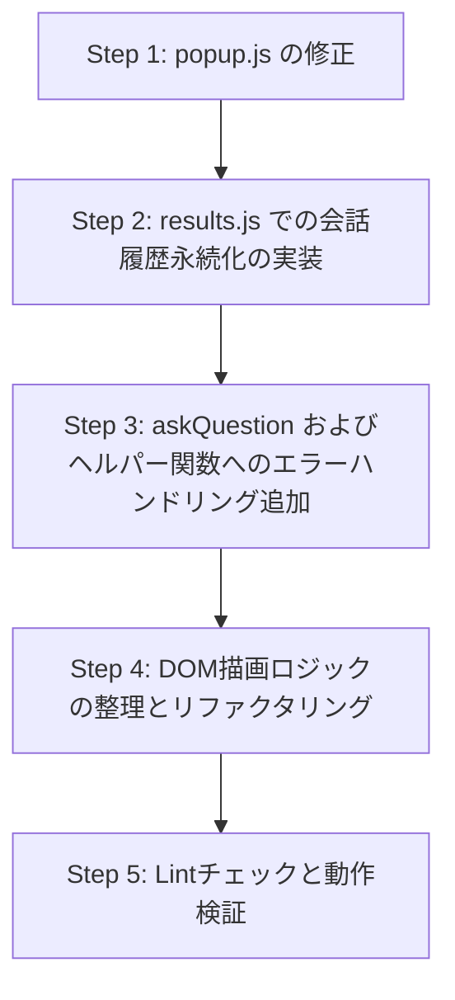

# 実装計画: `extension/results.js` のリファクタリング

本ドキュメントは、[extension/results.js](file:///home/taira/nfs/git/extension-summarize-translate-gemini/extension/results.js) におけるエラー処理の追加およびフォローアップ会話履歴の永続化に対応するためのリファクタリング計画です。再レビューによるすべての追加の改善点を取り入れています。

---

## 1. 背景と目的

現在、フォローアップの質問と回答 of 履歴はメモリ上の配列（`conversation`）にのみ保持されており、結果タブのページをリロードすると消失してしまいます。また、`results.js` 内の API 呼び出し、クリップボードへのコピー、ファイル出力などの処理においてエラーハンドリングが不足しています。そのため、API エラーやネットワーク障害が発生した際に、ローディング表示が消えなかったり、各種ボタンやテキストエリアが操作不能な状態（Disabled）のままになったりする課題があります。

### 目的

- **永続化:** セッションストレージ（`chrome.storage.session`）を使用して、フォローアップ会話の履歴を安全に保存・復元できるようにする。
- **堅牢性の向上:** 非同期処理（API 呼び出しなど）やコピー・保存処理に適切なエラーハンドリングを追加し、エラー発生時や保存失敗時にもUIやアプリケーションが正常に復帰・動作できるようにする。
- **コードの整理:** DOM 描画処理や UI コントロールの状態制御をヘルパー関数に整理し、メンテナンス性を向上させる。

---

## 2. 課題と改善方針

### 課題A: リロード時のフォローアップ会話履歴の消失と整合性の確保

- **現在の挙動:** `conversation` はグローバルに `const conversation = [];` として定義されていますが、ストレージへの保存・復元処理はありません。
- **改善方針:**
  - 質問と回答が正常に生成されたタイミングで、セッションストレージの `conversation_${resultIndex}` キーに会話履歴を保存します。
  - 初期化処理（`initialize`）時に、この履歴をロードし、**データのバリデーション（配列判定、各オブジェクトのキーと型のチェック）**を行います。
    - **不正なデータの扱い:** もしデータが不正（`validateConversation` が `false`）な場合は、UIへの描画やメモリへの読み込みを行わず、単に無視します（セッションストレージの削除までは行いません）。
  - 「会話をクリア」ボタンが押された際に、該当するセッションストレージのデータを削除します。この削除処理を非同期で行うため、`clearConversation()` は `async` 化します。
    - **先行処理の徹底:** 画面上の表示を即座にリセットするため、UIのクリアおよびメモリ上の配列クリア（`conversation.length = 0`）を非同期削除処理（`await`）よりも前に先行して同期的に行います。その後、ストレージ削除処理を `try...catch` で保護して実行し、失敗時は `console.error` でログ出力します。
  - 新規の要約・翻訳タスクが開始されたときに古いチャット履歴が混ざらないよう、[extension/popup.js](file:///home/taira/nfs/git/extension-summarize-translate-gemini/extension/popup.js) 側でも新規実行時に `conversation_${resultIndex}` をクリアするように連携します。

### 課題B: エラーハンドリングの不足と履歴混入の防止

- **現在の挙動:** `askQuestion` 内の `generateContent` や `streamGenerateContent` は `try...catch` で囲まれていますが、APIレスポンスのブロックやエラーのハンドリングが不足しており、またそれらが会話履歴に保存されてしまいます。
- **改善方針:**
  - `askQuestion` 内の API 呼び出しから UI 反映までの処理全体を `try...catch` で囲み、確実にリソースクリアとUI復帰を行うようにします。
  - 正常な応答のみを会話履歴に含めるため、`isSuccessfulResponse(response, apiProvider)` ヘルパー関数を導入してプロバイダごとに厳密にチェックします。Gemini の判定においては `getResponseContent()` と同様に `thought` フィールドを考慮した判定を行います。
    - **【注記】二重管理への注意点:** レスポンス仕様の変更時には、[extension/results.js](file:///home/taira/nfs/git/extension-summarize-translate-gemini/extension/results.js) の `isSuccessfulResponse()` と [extension/utils.js](file:///home/taira/nfs/git/extension-summarize-translate-gemini/extension/utils.js) の `getResponseContent()` を同時に更新する必要があります。
    - **【仕様】エラー応答の非永続化:** APIエラー応答、ブロック（安全フィルター等によるブロック）応答、例外発生時の一時的なエラー表示は、意図した仕様としてセッションストレージには保存されません。そのため、ページのリロードを行うとこれらのエラー表示はチャット履歴から綺麗に消去されます。
  - **自動保存（autoSave）のエラー分離:** 自動保存処理（`saveContent`）を呼び出す際は別個の `try...catch` で保護し、保存エラーがチャット本体の表示処理に影響を与えないようにします。
  - **コピー・保存処理のエラー処理:** `copyContent` や `saveContent` の処理中に発生したエラーは `try...catch` でキャッチし、UI上はエラーを表示せず、コンソールへの `console.error` 出力のみとします。
  - **セッション保存時の例外保護:** `chrome.storage.session.set()` がクォータ制限などで失敗した場合でもチャット機能を壊さないよう、保存処理を `try...catch` で囲み、失敗時は `console.error` を出力するに留めます。
  - **ストリーミングタイマーのエラー処理:** `setInterval` コールバック内の例外は、発生頻度が低いことおよび他コンポーネント（`popup.js`）の実装レベルに合わせるため、個別の `try...catch` 保護は行わず既存と揃えます。

### 課題C: UIのDOM構築ロジックの散在

- **現在の挙動:** `convertMarkdownToHtml` の適用や DOM 要素の作成・挿入が `askQuestion` 内でアドホックに行われています。
- **改善方針:**
  - UI 描画処理を以下のヘルパー関数として抽出します：
    - `appendQuestionToUi(question)`: ユーザーの質問用 UI ノードを作成し追加する。
    - `appendAnswerPlaceholderToUi()`: モデルの回答用 UI プレースホルダーを作成し追加する。
    - 初期化時の復元描画でもこれらのヘルパー関数および `renderLinks` 設定を適用して、一貫した描画を行います。

---

## 3. 詳細設計と修正内容

### 3.1. `extension/popup.js` の変更

`main` 関数で、新規要約/翻訳が開始されたときに古い会話データをクリアします。

```diff
  // Clear stale result to prevent results.html from picking up old data
  await chrome.storage.session.remove(`result_${resultIndex}`);
+ await chrome.storage.session.remove(`conversation_${resultIndex}`);
```

### 3.2. `extension/results.js` の変更

#### ストレージ設計と定数

- **結果データ:** `result_${resultIndex}`
- **フォローアップ会話データ:** `conversation_${resultIndex}` (`[{ role, parts }]` 形式で `user` / `model` が交互に並ぶ配列)

#### 復元時のバリデーション

`initialize` 時の復元処理において、読み込んだデータが正しい構造であることを判定します。

```javascript
const validateConversation = (data) => {
  if (!Array.isArray(data)) {
    return false;
  }

  if (data.length % 2 !== 0) {
    return false;
  }

  return data.every((item, index) => {
    if (!item || typeof item !== "object") {
      return false;
    }

    const expectedRole = index % 2 === 0 ? "user" : "model";
    return item.role === expectedRole && Array.isArray(item.parts);
  });
};
```

#### 正常応答の判定ヘルパー

```javascript
const isSuccessfulResponse = (response, apiProvider) => {
  if (!response || !response.ok) {
    return false;
  }
  if (apiProvider === "openai") {
    const choice = response.body?.choices?.[0];
    return choice?.finish_reason === "stop" && Boolean(choice?.message?.content);
  } else {
    const candidate = response.body?.candidates?.[0];
    const hasBlock = response.body?.promptFeedback?.blockReason || (candidate?.finishReason && candidate.finishReason !== "STOP");
    const parts = candidate?.content?.parts || [];
    const responsePart = parts[0]?.thought === true ? parts[1] : parts[0];
    return !hasBlock && typeof responsePart?.text === "string" && responsePart.text.length > 0;
  }
};
```

#### 会話履歴（`conversation`）の中身更新

`conversation` は `const` 配列として宣言されているため、再代入を行わず、配列操作によって中身を入れ替えます。

```javascript
// 復元時
conversation.length = 0;
conversation.push(...loadedConversation);
```

#### `askQuestion` の修正案

```javascript
const askQuestion = async () => {
  const question = document.getElementById("text").value.trim();
  if (!question) return;

  // 1. コントロールの無効化とローディング設定
  setResultControlsEnabled(false);
  let displayIntervalId = setInterval(displayLoadingMessage, 500, "send-status", chrome.i18n.getMessage("results_waiting_response"));
  
  // 2. ユーザーの質問をUIに追加し入力欄をクリア
  appendQuestionToUi(question);
  document.getElementById("text").value = "";

  // 3. 回答用のプレースホルダーをUIに追加
  const formattedAnswerDiv = appendAnswerPlaceholderToUi();
  window.scrollTo(0, document.body.scrollHeight);

  let answer = "";
  let streamIntervalId = null;

  try {
    const {
      apiKey, apiProvider, openaiApiKey, openaiBaseUrl, openaiModelId,
      streaming, userModelId, renderLinks, autoSave, openaiReasoningEffort, openaiThinkingType
    } = await chrome.storage.local.get({
      apiKey: "", apiProvider: "gemini", openaiApiKey: "", openaiBaseUrl: "",
      openaiModelId: "", streaming: false, userModelId: "", renderLinks: false,
      autoSave: false, openaiReasoningEffort: "", openaiThinkingType: ""
    });

    const languageModel = document.getElementById("languageModel").value;
    const effectiveApiKey = apiProvider === "openai" ? openaiApiKey : apiKey;
    const effectiveModelId = apiProvider === "openai" ? openaiModelId : userModelId;
    const baseUrl = openaiBaseUrl;

    const extraConfig = apiProvider === "openai"
      ? { reasoningEffort: openaiReasoningEffort, thinkingType: openaiThinkingType }
      : {};

    const modelConfigs = getModelConfigs(languageModel, effectiveModelId, apiProvider, extraConfig);

    // API用メッセージ履歴の構成
    const apiContents = [...result.requestApiContent];
    apiContents.push({ role: "model", parts: [{ text: result.responseContent }] });
    conversation.forEach((message) => {
      apiContents.push({ role: "user", parts: [{ text: message.question }] });
      apiContents.push({ role: "model", parts: [{ text: message.answer }] });
    });
    apiContents.push({ role: "user", parts: [{ text: question }] });

    let response;
    if (streaming) {
      const streamKey = `streamContent_${resultIndex}`;
      const responsePromise = streamGenerateContent(effectiveApiKey, apiContents, modelConfigs, streamKey, apiProvider, baseUrl);

      console.log("Request:", {
        apiContents,
        modelConfigs,
        streamKey
      });

      // Stream the content
      streamIntervalId = setInterval(async () => {
        const streamContent = (await chrome.storage.session.get({ [streamKey]: "" }))[streamKey];
        if (streamContent) {
          formattedAnswerDiv.innerHTML = convertMarkdownToHtml(streamContent, false, renderLinks);
        }
      }, 1000);

      response = await responsePromise;
      clearInterval(streamIntervalId);
      streamIntervalId = null;
    } else {
      response = await generateContent(effectiveApiKey, apiContents, modelConfigs, apiProvider, baseUrl);
    }

    console.log("Response:", response);
    answer = getResponseContent(response, Boolean(effectiveApiKey), apiProvider);

    // Update the formatted answer in the conversation
    formattedAnswerDiv.innerHTML = convertMarkdownToHtml(answer, false, renderLinks);

    // モデルバージョンの表示更新
    if (languageModel.includes("/")) {
      document.getElementById("send-status").textContent = response.body?.modelVersion ?? "";
    } else {
      document.getElementById("send-status").textContent = "";
    }

    // 正常な応答である場合のみ、会話履歴の追加とセッションストレージへの保存を行う
    if (isSuccessfulResponse(response, apiProvider)) {
      conversation.push({ role: "user", parts: [{ text: question }] });
      conversation.push({ role: "model", parts: [{ text: answer }] });
      try {
        await chrome.storage.session.set({ [`conversation_${resultIndex}`]: conversation });
      } catch (storageError) {
        console.error("Failed to save conversation to session storage:", storageError);
      }
      
      if (autoSave) {
        try {
          saveContent();
        } catch (saveError) {
          console.error("Auto-save failed:", saveError);
        }
      }
    } else {
      console.warn("API response was not successful or was blocked:", response);
    }

  } catch (error) {
    console.error("Failed to generate content:", error);
    if (streamIntervalId) {
      clearInterval(streamIntervalId);
    }
    
    // UIをエラー表示に切り替え
    formattedAnswerDiv.textContent = chrome.i18n.getMessage("response_unexpected_response");
    document.getElementById("send-status").textContent = "";
  } finally {
    clearInterval(displayIntervalId);
    setResultControlsEnabled(true);
    window.scrollTo(0, document.body.scrollHeight);
  }
};
```

---

## 4. 実装手順



### Step 1: `popup.js` の修正

- `popup.js` 内で、新規実行時に `conversation_${resultIndex}` をセッションストレージから削除する処理を追加します。

### Step 2: `results.js` での会話履歴永続化の実装

- `initialize` 時にセッションストレージからデータをロードし、バリデーションした上で、UIに過去の会話（質問と回答）を描画します。回答描画時は `renderLinks` 設定を適用します。
- `clearConversation()` を `async` 化し、メモリおよびUIのリセットを先行して同期実行した上で、セッションストレージのデータ削除を `try...catch` で保護しつつ実行します。
- `askQuestion` において、正常な応答判定（`isSuccessfulResponse`）が通った場合にのみ、`try...catch` で保護しつつ `chrome.storage.session.set` を実行します。

### Step 3: エラーハンドリングの追加と分離

- `askQuestion` を `try...catch` で囲み、エラー発生時にもローディングの `clearInterval` やコントロールの再有効化（`setResultControlsEnabled(true)`）が確実に実行されるようにします。
- 自動保存 `saveContent()` 呼び出し時に別個の `try...catch` を設け、保存エラーが回答の描画を壊さないようにします。
- `copyContent` や `saveContent` の処理にも `try...catch` を導入し、エラー時はUI表示を行わずコンソールへの `console.error` 出力のみとします。

### Step 4: DOM描画処理の整理

- ユーザーの質問やモデルの回答を追加する部分をヘルパー関数に分割し、コードの重複を排除します。

### Step 5: Lintチェックと動作検証

- `npm run lint` を実行し、スタイルエラーを修正します。
- Gemini および OpenAI の両プロバイダ、またストリーミング・非ストリーミングの双方でテストを行います。
- APIエラー発生時や保存失敗時のUI復帰や、エラー会話が履歴に混入しないことを確認します。
