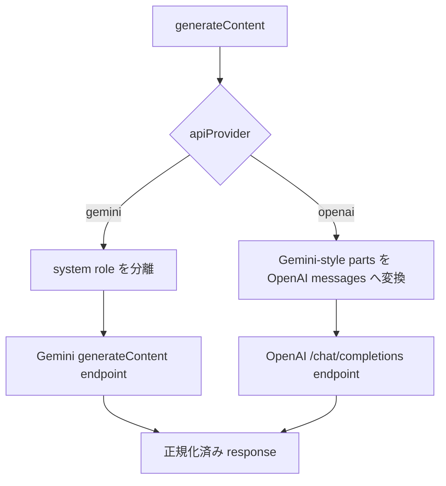

# Phase 2: LLM provider の non-streaming contract test 導入手順

## 1. 目的と完了範囲

この手順は [`TESTING_PLAN_PERSONAL.md`](./TESTING_PLAN_PERSONAL.md) の実装順序 2
「provider contract test」を実施するためのものです。Phase 1 で導入済みの Vitest を
使い、最も回帰リスクの高い `generateContent()` の provider 境界を、実 API を呼ばずに
固定します。

この段階で実現すること:

- Gemini と OpenAI 互換 API の **non-streaming** request / response 契約を検証する。
- `fetch` をテストごとに mock し、URL、method、header、request body と戻り値を検証する。
- Gemini の system instruction 分離、画像を含む `parts`、thinking 設定を検証する。
- OpenAI 形式への role / content / image 変換、Base URL、reasoning 設定を検証する。
- HTTP error、ネットワークエラー、OpenAI Base URL の未設定・不正を検証する。
- 実 API、実ブラウザー、固定時間の待機を使わない。

この段階で実現しないこと:

- `streamGenerateContent()`、SSE、Gemini streaming JSON のテスト
- 503 retry、429/503 model fallback、retry status のテスト
- fake timer、`sleep` / `fetch` の本体への依存注入
- `chrome.storage` / runtime の包括的 fake、popup・results・options の DOM test
- Markdown/XSS test、manifest/locale 整合性 test、Playwright E2E
- provider 実装の挙動変更や大規模リファクタリング

streaming と retry/fallback は、`TESTING_PLAN_PERSONAL.md` の実装順序 3 として別段階に
分ける。Phase 2 で追加する `fetch` helper は後続段階から再利用してよいが、先回りして
production code の依存注入を導入しない。

## 2. 対象コードと現在の契約

対象は `extension/utils.js` の次の公開入口です。

- `generateContent(apiKey, apiContents, modelConfigs, apiProvider, openaiBaseUrl, retryStatusKey)`
- `getResponseContent(response, hasApiKey, apiProvider)`（Phase 1 で基本分岐をテスト済み）

`generateContent()` は provider により内部処理を分岐する。



この Phase では公開 API を維持する。`generateContentGemini()`、
`generateContentOpenAI()`、`extractSystemInstruction()`、`convertToOpenAI()` は内部関数の
ため、直接 export して unit test しない。公開入口から観測できる HTTP 契約として固定する。

### 2.1 共通の response 形式

`generateContent()` の結果は次の形式である。

```text
{ ok: boolean, status: number, body: object }
```

- 成功時は HTTP status と JSON parse 済みの response body を返す。
- HTTP error も `fetch` が解決する限り throw せず、`ok: false` と API の body を返す。
- `fetch` が reject した場合は `status: 1000` を返す。
- OpenAI Base URL が未設定なら `1002`、不正なら `1003` を返す。

テストは API response 全体の snapshot ではなく、上記の正規化形式と必要な body を明示的に
比較する。Authorization の実値を失敗出力に含めない。

## 3. 実装前の確認

リポジトリのルートで、作業開始前に次を確認する。

1. `npm run lint` が成功する。
2. `npm test` が成功し、Phase 1 の `test/unit/utils.test.js` が通る。
3. `package.json` に `vitest`、`test`、`test:watch` が存在する。
4. `extension/utils.js` の現在の `generateContent()` 実装を確認する。
5. 未コミット変更を確認し、関係ない変更を混在させない。

既存のテストが失敗している場合は、Phase 2 を始める前に原因を分離する。テストしながら
仕様改善を行わない。疑わしい挙動を見つけた場合も、まず現挙動を契約として固定し、修正は
別変更にする。

## 4. 変更するファイル

標準的には次のファイルを変更・追加する。

| ファイル | 変更内容 |
| --- | --- |
| `test/helpers/fetch-mock.js` | fetch 呼び出しの記録、固定 HTTP response、network rejection を作る helper を追加する |
| `test/contract/generate-content.test.js` | Gemini と OpenAI の non-streaming contract test を追加する |
| `extension/utils.js` | 原則変更しない。テストで観測した現挙動をそのまま固定する |
| `package.json` / `eslint.config.mjs` | 通常は変更不要。新しい test directory が既存 ESLint 対象に入ることだけ確認する |

fixture を JSON ファイルとして分離するのは、同じ payload が複数ケースで読みにくくなる場合に
限る。最初から細分化しすぎず、テストの近くに小さな builder を置く。fixture を追加する場合は
`test/fixtures/gemini/` と `test/fixtures/openai/` に provider ごとに配置する。

## 5. fetch mock helper の作成

`test/helpers/fetch-mock.js` を作成する。helper の目的は、`globalThis.fetch` を安全に
差し替え、呼び出し内容を検証可能にし、各テスト後に確実に復元することである。

### 5.1 helper の責務

最低限、次を満たす API にする。

- 指定した status、body、headers の Response を返せる。
- 呼び出された URL と `RequestInit` をテストから参照できる。
- `fetch` reject（ネットワークエラー）を再現できる。
- mock を 1 回だけ返すケースと、複数回の順番付き response を返すケースを表せる。
- `globalThis.fetch` をテスト終了後に元へ戻せる。

Phase 2 では `vi.fn()` と標準の `Response` を使えばよい。HTTP response の組み立て例は
次の仕様を満たせばよい。

- JSON body は `JSON.stringify()` して `Content-Type: application/json` を付ける。
- plain text error では JSON 化せず、`text()` で読める body を返す。
- `204` のように body を持てない status は、この Phase ではテスト対象にしない。

### 5.2 テストの cleanup

`test/contract/generate-content.test.js` では、各 test の前後で次を行う。

1. 既存の `globalThis.fetch` を保存する。
2. テスト用 fetch mock を設定する。
3. テスト終了後に `vi.restoreAllMocks()` または保存済みの fetch を復元する。
4. mock の calls、残った一時状態をリセットする。

この Phase の non-streaming Gemini / OpenAI 成功経路では `chrome.i18n` を実行しない。Phase 1 の
`chrome.i18n` stub を contract test に複製する必要はない。

ただし、Gemini 経路は `generateContentWithFallback()` を経由し、その末尾で必ず
`reportRetryStatus(retryStatusKey, null)` を呼ぶ。`retryStatusKey` が truthy の場合は
`chrome.storage.session.remove()` が実行されるため、テストで `retryStatusKey` に任意の文字列を
渡すと `chrome is not defined` になる。Phase 2 では `retryStatusKey` に `undefined` または空文字を
渡すことで `chrome.storage` 呼び出しを回避する。将来 retry status を扱う Phase 3 では
`chrome.storage.session` の最小 fake を用意する。

## 6. contract test の共通記述規則

### 6.1 実データを使わない

次を fixture、テスト名、期待値、failure message に入れない。

- API key や `Authorization` header の実値
- 個人情報、非公開 URL、実会話、実ページ本文
- 実 provider から取得した response の丸ごとコピー

テストでは `test-api-key` のようなダミー値を使う。Authorization は完全一致ではなく
`Bearer test-api-key` として request object 内だけを検証し、console 出力しない。

### 6.2 URL と body の検証方法

fetch mock の最初の call を取り出し、以下を個別に確認する。

1. URL
2. `method`
3. `headers`
4. `body` を `JSON.parse()` した object

`RequestInit.body` の文字列全体を比較しない。JSON property の順序への不要な依存を避ける。

### 6.3 1 ケース 1 契約

- request 変換を確認する test と error response を確認する test を分離する。
- Gemini と OpenAI を別の `describe()` に分ける。
- production code の private helper 名を test 名に出さず、外部から見える契約を説明する。
- `toMatchObject()` は関係ない safety setting 等を過度に固定しないために使えるが、重要な
  fields（model、messages/contents、system instruction、generation config）は明示比較する。

## 7. 実装するテストケース

以下の「必須」をすべて実装する。必要なら 1 つのケースを複数の `it()` に分ける。

### 7.1 Gemini: request contract（必須）

#### G-01: endpoint、header、基本 contents

入力:

- `apiProvider: "gemini"`
- 1 つの user content（`{ role: "user", parts: [{ text: "test prompt" }] }`）
- model ID と空の generation config

確認事項:

- URL が `https://generativelanguage.googleapis.com/v1beta/models/<modelId>:generateContent`
- method が `POST`
- `Content-Type` が `application/json`
- `x-goog-api-key` がダミー key
- body の `contents` が入力の user content
- `systemInstruction` がない場合、request JSON ではそのプロパティが送信されないこと
- `generationConfig` が model config の値
- `safetySettings` が常に含まれることのみ確認し、各 category/threshold の値は過度に固定しない
- 成功 response が `{ ok: true, status: 200, body }` に正規化される

#### G-02: system role の分離と複数 part の維持

入力に `role: "system"` の item と user item を混在させる。

確認事項:

- system の parts が `systemInstruction.parts` にまとめられる。
- `contents` に system role が残らない。
- 元の user/model の順序と parts（text、`inline_data`）が維持される。
- 複数の system item がある場合は parts が入力順に連結される。

`apiContents` 自体を書き換えていないことも、必要なら呼び出し前の deep copy と比較して確認する。

#### G-03: 画像を含む input

`inline_data` と text を同じ user parts に含める。

確認事項:

- Gemini request が `inline_data` の key、mime type、data を変換せず保持する。
- image を理由に user text や system instruction が欠落しない。

payload は短い架空の base64 文字列にする。実画像データを置かない。

#### G-04: thinking configuration

`generationConfig.thinkingConfig` に thinking level と thinking budget の代表値を渡す。

確認事項:

- `generationConfig` が Gemini request body にそのまま入る。
- level と budget は別 test にし、`getModelConfigs()` の Phase 1 test と責務を重複させない。

### 7.2 Gemini: response / error contract（必須）

#### G-05: HTTP error JSON（retry 対象外）

fetch が `400` と JSON error body を返す。single model かつ `400` は `isRetryableStatus()` に
引っかからないため、retry に入らず即座に返す。

確認事項:

- `generateContent()` が throw しない。
- `ok` が `false`、status が `400`。
- `body.error.message` が保持される。
- retry に入らないため、実時間の待機が発生しない。

#### G-05b: single model で 429 は retry せず即座に返す

fetch が `429` と JSON error body を返す。single model の 429 は `isRetryableStatus(429)` が
`false` になるため retry に入らず、即座に返す現在の挙動を固定する。

確認事項:

- `ok` が `false`、status が `429`。
- `body.error.message` が保持される。
- retry に入らないため、実時間の待機が発生しない。
- 429 による model fallback は複数モデル時のみ発生するため、Phase 3 で検証する。

#### G-06: JSON でない HTTP error

fetch が `500` と plain text の body を返す。

確認事項:

- `{ ok: false, status: 500 }` を返す。
- body が `tryParseJson()` の現挙動どおり `{ error: { message: "..." } }` へ正規化される。

#### G-07: network error

fetch mock を `TypeError("network unavailable")` で reject させる。

確認事項:

- `{ ok: false, status: 1000 }` を返す。
- `body.error.message` が空でない。
- raw error object、API key、request headers が結果へ露出しない。

### 7.3 OpenAI 互換: request contract（必須）

OpenAI 経路は `generateContent()` が `modelConfigs[0]` のみ使用し、retry/fallback 経路を
通らない。テスト setup では 1 config だけ用意すればよい。

#### O-01: Base URL 正規化と endpoint

入力 Base URL は path、trailing slash、query/hash を含むダミー URL とする。

確認事項:

- request URL が正規化済み Base URL + `/chat/completions` になる。
- query/hash が送信 URL に残らない。
- method が `POST`、`Content-Type` が JSON、Authorization が `Bearer <dummy>`。

Base URL の正規化規則は `normalizeBaseUrl()` の Phase 1 test と同じ値を利用してよい。

#### O-02: role と text content の変換

Gemini-style の `system`、`user`、`model` を含む `apiContents` を渡す。

確認事項:

- system が OpenAI の `{ role: "system", content: "..." }` になる。
- user が `{ role: "user", content: "..." }` になる。
- model が `{ role: "assistant", content: "..." }` になる。
- text parts が区切り文字なしで連結される（`join("")`）現在の形式を固定する。
- request body が `model` と `messages` を持つ。

空 parts、複数 text parts などの edge case は、実装を確認して必要になった時点で追加する。

#### O-03: multimodal image の変換

text と `inline_data` を持つ user content を渡す。

確認事項:

- OpenAI user `content` が text/image の content-part 配列になる。
- image が `type: "image_url"` になり、data URL の mime type と data が維持される。
- text と image の相対順序が維持される。

#### O-04: reasoning parameters の送信・省略

2 つの test を作る。

1. `reasoningEffort: "low"` と `thinkingType: "enabled"` を指定する。
   - `reasoning_effort: "low"`
   - `thinking: { type: "enabled" }`
2. 両方が空文字または未指定である。
   - `reasoning_effort` と `thinking` が request body に存在しない。

### 7.4 OpenAI 互換: response / error contract（必須）

#### O-05: 正常 response

OpenAI chat completion 形式の最小 JSON body を返す。

確認事項:

- `ok: true`、HTTP status、body が保持される。
- `getResponseContent()` との結合は Phase 1 の責務なので、この test では response の
  正規化だけを確認する。

#### O-06: JSON でない HTTP error

`502` と plain text error を返す。

確認事項:

- `ok: false`、status が `502`。
- `body.error.message` が plain text を保持する。

#### O-07: Base URL 未設定・不正

2 つの test を作る。

- 空の Base URL: `status: 1002`、fetch が呼ばれない。
- URL として解釈できない Base URL: `status: 1003`、fetch が呼ばれない。

両ケースとも `body.error.message` は既存の英語エラー文を含むことを確認する。これは
`getResponseContent()` が利用する内部エラー契約でもある。

#### O-08: network error

fetch reject 時に Gemini と同様 `status: 1000` を返すことを確認する。

### 7.5 Phase 2 では保留するケース

次は重要だが、責務を分けるため Phase 3 へ回す。

- OpenAI SSE の任意 chunk 境界、`[DONE]`、malformed event
- Gemini streaming JSON 配列の任意 chunk 境界、末尾 error
- 503 の 5 秒・10 秒 backoff、成功時の retry 終了
- 429/503 による複数 Gemini model の fallback
- `retryStatusKey` に対する storage set/remove
- streaming 中に更新される `streamKey` の storage 値

## 8. 実装順序

小さく実行・確認できる単位で進める。

1. `npm run lint && npm test` を実行し、Phase 1 の基準状態を確認する。
2. `test/helpers/fetch-mock.js` を追加する。成功 JSON response を 1 件返し、URL と body を
   検証できる最小機能だけ実装する。
3. `test/contract/generate-content.test.js` を追加し、G-01 を 1 件実装する。
4. `npm test` を実行し、ESM import、`Response`、fetch restoration が問題ないことを確認する。
5. G-02〜G-04 を追加し、Gemini の request contract を完成させる。
6. G-05〜G-07（G-05b 含む）を追加し、Gemini error contract を完成させる。503 retry を意図せず実時間で
   待たないよう、該当ケースの model 数と status を再確認する。
7. O-01〜O-04 を追加し、OpenAI request conversion を完成させる。
8. O-05〜O-08 を追加し、OpenAI error contract を完成させる。
9. `npm test` を実行する。失敗時は mock の漏れ、期待値の仕様化しすぎ、実装の現挙動との差を
   1 件ずつ切り分ける。
10. `npm run lint` を実行する。
11. `npm run lint && npm test` を連続して実行する。
12. `git diff` を確認し、API key、Authorization の実値、実会話、不要な production change が
    含まれないことを確認する。

テストのために `utils.js` を変更したくなった場合は、まず public API と fetch mock だけで
観測できない理由を記録する。Phase 2 では安易に private function を export しない。
依存注入が必要な retry/streaming は Phase 3 の独立した変更として扱う。

## 9. 失敗時の判断

| 症状 | 確認・対処 |
| --- | --- |
| `fetch is not defined` | Node/Vitest の実行環境と global replacement を確認する。必要なら helper が mock を明示的に設定する |
| 別 test の fetch mock が残る | `afterEach` で restoration を必ず実行し、状態を module global に置かない |
| 503 case が遅い | Phase 2 の範囲外の retry に入っている。400 または single model の 429 を使うか、複数 model の fallback 条件を避けて HTTP error 契約だけ確認する |
| Authorization が assertion failure に出る | ダミー key のみを使い、実 key を環境変数からも読まない |
| request body の完全一致が壊れやすい | JSON 文字列ではなく parse 済み object の重要 fields を検証する |
| 期待値と実装が違う | 仕様変更ではなく characterization の対象かを判断する。現挙動ならテストを合わせ、バグ修正は別変更に分離する |

## 10. 完了条件

以下をすべて満たしたら Phase 2 は完了とする。

- `test/helpers/fetch-mock.js` または同等の再利用可能な fetch mock helper がある。
- `generateContent()` を通じて Gemini と OpenAI 互換 API の non-streaming request contract を
  検証している。
- G-01〜G-07（G-05b 含む）、O-01〜O-08 の必須ケースを実装している。
- Gemini の system instruction 分離、画像 input、thinking config を検証している。
- OpenAI の Base URL、role/text/image 変換、reasoning parameters の送信・省略を検証している。
- HTTP error、plain text error、network error、OpenAI Base URL の内部 error code を検証している。
- 通常テストは実 API、外部 Web サイト、実ブラウザー、固定 sleep を使わない。
- `npm test` と `npm run lint` が成功する。
- fixture、snapshot、ログ、失敗出力に秘密情報や実会話を含めていない。
- `extension/utils.js` の機能変更や、streaming/retry の先行実装を混在させていない。

## 11. 次の段階

Phase 2 完了後は、実装結果を確認してから Phase 3 の手順書を作成する。Phase 3 では
`streamGenerateContent()` を対象に、次を扱う。

1. OpenAI SSE と Gemini streaming JSON の任意 chunk 境界
2. `[DONE]`、malformed input、stream 末尾 error
3. fake timer または小さな依存注入による 503 retry
4. 429/503 による model fallback と成功時の終了
5. `chrome.storage.session` の最小 fake を使った stream/retry 状態の確認

Phase 2 の request/response fixtures と fetch helper を再利用しつつ、streaming と retry の
責務をこの段階へ逆流させない。
