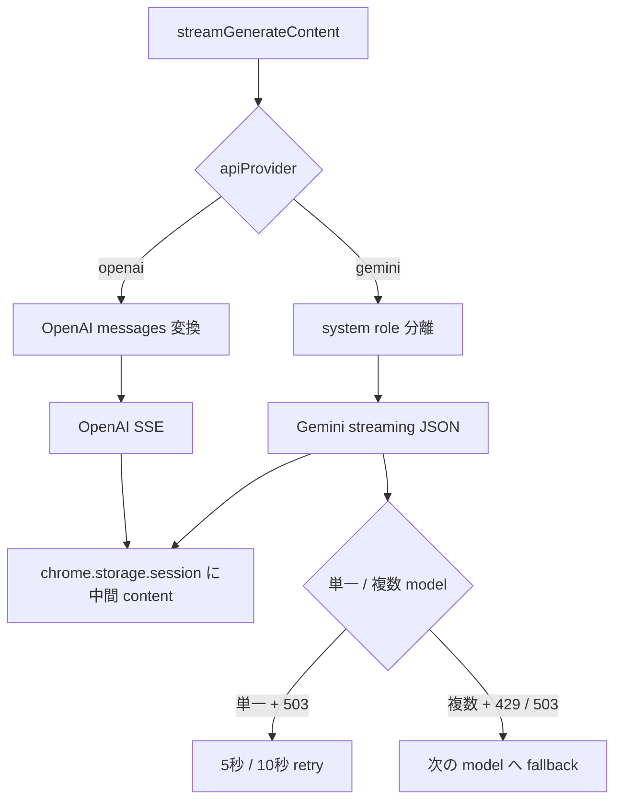

# Phase 3: streaming / retry / fallback contract test 導入手順

## 1. 目的と完了範囲

この手順は [`TESTING_PLAN_PERSONAL.md`](./TESTING_PLAN_PERSONAL.md) の実装順序 3
「streaming / retry test」を実施するためのものです。Phase 1 / 2 で導入済みの
Vitest と fetch mock を使い、`extension/utils.js` の公開入口
`streamGenerateContent()` と `generateContent()` における、時間と状態を伴う契約を
実 API なしで固定します。

この段階で実現すること:

- OpenAI 互換 API の SSE を、イベント境界とは無関係な任意のネットワーク chunk 分割で検証する。
- Gemini の streaming JSON 配列を、途中で分割された chunk から復元する挙動を検証する。
- 正常終了、`[DONE]`、不正な event、stream 末尾の API error を検証する。
- 単一 Gemini model の HTTP 503 に対する 2 回の retry（5 秒、10 秒）と、成功時の終了を fake timer で検証する。
- 複数 Gemini model の HTTP 429 / 503 で、待機せず次の model へ fallback することを検証する。
- `chrome.storage.session` の最小 fake により、stream の中間テキストと retry / fallback 状態を検証する。
- 実 API、外部 Web サイト、実ブラウザー、実時間の待機を使わない。

この段階で実現しないこと:

- popup、results、options の DOM test や UI 表示の詳細な検証
- `chrome.storage` / `chrome.runtime` 全体を再現する fake
- Markdown/XSS、manifest / locale 整合性、Chromium E2E
- OpenAI 互換 API の retry / fallback（現実装は OpenAI 経路に fallback を持たない）
- provider の挙動変更、retry 回数・待機時間・stream parser の仕様改善
- 実 API に接続する smoke test

この Phase は characterization test である。現実装の挙動に疑問があっても、まず
公開 API から観測できる契約を固定する。不具合修正や parser の強化は別変更として分離する。

## 2. 対象コードと現行契約

対象の公開 API は以下である。

- `streamGenerateContent(apiKey, apiContents, modelConfigs, streamKey, apiProvider, openaiBaseUrl, retryStatusKey)`
- `generateContent(apiKey, apiContents, modelConfigs, apiProvider, openaiBaseUrl, retryStatusKey)`

Phase 2 では `generateContent()` の non-streaming request / response を検証済みである。
この Phase ではそのうち retry / fallback の分岐も追加で検証し、streaming では
`streamGenerateContent()` のみを公開 API として扱う。内部関数を export して直接テストしない。

以下の図は streaming 経路の概要である。non-streaming も同じ retry / fallback 構造を持つが、
stream parser と `streamKey` 更新は持たない。



### 2.1 Gemini non-streaming retry / fallback

Gemini の `generateContent()` は、内部で以下の規則を持つ。

| 条件 | 現行の挙動 |
| --- | --- |
| model が 1 件、HTTP 503 | 最大 2 回 retry。待機は順に 5,000 ms、10,000 ms |
| model が 1 件、503 以外 | retry せず、その response を返す |
| model が複数、HTTP 429 または 503 | 待機せず、次の model を 1 回試す |
| model が複数、429 / 503 以外 | その response を返し、fallback しない |
| retry / fallback 後に成功 | ただちに終了し、後続 model を呼ばない |
| 全 model が fallback 対象 error | 最後の response を返す |

retry 中は `retryStatusKey` があれば `chrome.storage.session.set()` に次の object を記録する。

```text
{
  phase: "retrying",
  status: 503,
  attempt: 1 または 2,
  maxAttempts: 2,
  delayMs: 5000 または 10000
}
```

複数 model の fallback 時は次を記録する。

```text
{ phase: "fallback", status: 429 または 503 }
```

終了時には `chrome.storage.session.remove(retryStatusKey)` が呼ばれる。現実装ではループ内の
終了処理と関数末尾の cleanup により、正常終了時に remove が複数回呼ばれ得る。Phase 3 では
**最終的に key が残らないこと**を必須契約とし、remove 回数の完全一致は実装詳細として固定しない。

### 2.2 Gemini streaming JSON

Gemini stream は JSON 配列として届く想定である。現実装は各 network chunk を buffer へ追加し、
`buffer + "]"` を JSON として parse できた時点で、未処理 candidate の text を連結して
`chrome.storage.session.set({ [streamKey]: content })` に保存する。

- 通常の part は最初の `parts[0].text` を content へ連結する。
- 最初の part が `{ thought: true }` の場合、thought は別に連結し、2 番目の part を content へ連結する。
- stream 全体が完了した後、最後の candidate を response body として返す。
- 最後の配列要素が `{ error: { code, message } }` なら、その code / message を error response に正規化する。

この parser は途中で JSON として parse できない chunk を待機する。意図的に不完全な JSON を
渡して「途中では storage を更新せず、完了後に正しく連結する」ことを確認する。

### 2.3 OpenAI SSE

OpenAI stream は改行区切りの `data:` event として処理する。

- `data: {JSON}` の `choices[0].delta.content` を受け取ると、既存 content の末尾へ連結して storage に保存する。
- `choices[0].finish_reason` を受け取ると、最終 response の `finish_reason` として返す。
- 空行、`data:` 以外の行、JSON として壊れた `data:` 行、`data: [DONE]` は無視する。
- stream 完了時は `{ ok: true, status: 200 }` と、連結済み content を持つ OpenAI 形式の body を返す。
- 現実装は末尾に改行のない SSE 行を buffer に残したまま終了する。この挙動を変更する場合は、
  まず別のバグ修正と regression test を作成する。Phase 3 の正常 fixture は末尾を改行で終える。

OpenAI stream は `stream: true`、role / image / reasoning parameter の変換を使う。変換自体は
Phase 2 で non-streaming として検証済みなので、Phase 3 では `stream: true` と stream 固有の
結果を中心に確認する。

## 3. 実装前の確認

作業開始前にリポジトリ root で次を確認する。

1. `npm run lint` が成功する。
2. `npm test` が成功し、Phase 1 / 2 のテストが通る。
3. `test/helpers/fetch-mock.js` が既存で、通常の JSON / text response と network error を queue できる。
4. `extension/utils.js` の retry 回数、backoff、storage key の形式を読み、上記「現行契約」と相違がないことを確認する。
5. 既存の未コミット変更に、関係ない機能変更を混在させない。

Vitest の fake timer はテスト間で共有状態になり得る。`vi.useFakeTimers()` を使うテストは必ず
`afterEach()` で `vi.useRealTimers()` を実行する。fetch mock と `globalThis.chrome` もテストごとに
復元する。cleanup が失敗すると、Phase 1 / 2 のテストに影響するため、最初に cleanup を完成させる。

## 4. 変更するファイル

| ファイル | 変更内容 |
| --- | --- |
| `test/helpers/fetch-mock.js` | 任意の `ReadableStream` body を返す response builder、または同等の stream response helper を追加する |
| `test/helpers/chrome-storage-mock.js` | `chrome.storage.session` の最小 in-memory fake を追加する |
| `test/contract/stream-generate-content.test.js` | Gemini / OpenAI streaming の contract test を追加する |
| `test/contract/generate-content.test.js` | Gemini non-streaming retry / fallback の contract test を追加する |
| `extension/utils.js` | 原則変更しない。fake timer で既存 `sleep()` を制御できるため、最初から依存注入を追加しない |

必要なら stream fixture builder を `test/helpers/` に追加してよいが、小さな文字列はテスト内に置く。
実 provider の response、実画像、実会話、API key はフィクスチャに含めない。

### 4.1 production code の変更が必要になった場合

最初に `extension/utils.js` を変更しない。`vi.useFakeTimers()` と queued fetch response で retry を
十分に制御できることを確認する。

テストの実装上どうしても時間待機を制御できない場合に限り、小さな依存注入を検討する。その場合も次を守る。

- 公開 API の引数を増やさない。
- デフォルトは現在の `fetch` / `sleep` と同じ挙動にする。
- injection 専用の export を追加しない。
- production code の変更、理由、現行挙動を保つテストを同じ小さな変更にまとめる。
- 503 retry と関係しないリファクタリングを混在させない。

## 5. テストヘルパーの設計

### 5.1 ストリーム応答ヘルパー

既存の `installFetchMock()` は queue に `Response` を入れられるため、helper には少なくとも
`ReadableStream<Uint8Array>` を作る機能を追加する。

推奨 API の例:

| helper | 責務 |
| --- | --- |
| `createChunkedStream(chunks)` | 文字列配列を UTF-8 `Uint8Array` の順に enqueue し、その後 close する |
| `createStreamResponse(status, chunks, headers)` | `createChunkedStream()` を body に持つ `Response` を返す |
| `enqueueStream(status, chunks, headers)` | fetch mock queue に streaming response を追加する |

設計上の要件:

- 各 chunk は短い架空の文字列だけを使う。
- `TextEncoder` を使い、実際の `TextDecoder(..., { stream: true })` の経路を通す。
- 成功 response は `Content-Type: application/json`（Gemini）または `text/event-stream`（OpenAI）を付ける。
- response body を一度しか読めない標準 `Response` の性質を維持する。
- `204` など body を持たない response は、この Phase の対象外である。

stream を 1 chunk だけで返す helper にしない。chunk 境界の回帰を防ぐため、正常ケースでも必ず
JSON / SSE event の途中で分割する。

R-01 / R-03 のように `await Promise.resolve()` による microtask flush を繰り返す場合は、必要なら
`test/helpers/` に `flushMicrotasks()` のような小さなテストヘルパーを置いてよい。ただし、timer
advance と microtask flush の責務を混ぜない。

### 5.2 最小 chrome.storage.session fake

`test/helpers/chrome-storage-mock.js` は、以下だけを実装する。

- `session.set(items)`
- `session.remove(key)`
- テストが最終値と履歴を確認するための `values`、`setCalls`、`removeCalls`
- `restore()` による元の `globalThis.chrome` の復元

`set()` は object の key/value を in-memory の `Map` または plain object に保存する。
`remove()` は string または string 配列を受けられるようにし、該当 key を削除する。

Phase 3 では `get()`、`onChanged`、sync / local storage、runtime message は実装しない。
Phase 1 の `chrome.i18n` stub と共存できるよう、既存 `globalThis.chrome` を shallow copy して
`storage.session` だけを追加する。テスト完了後は、install 前の値（未定義を含む）へ正確に戻す。

### 5.3 フィクスチャの生成規則

- storage key は `test-stream-key`、`test-retry-key` のような固定ダミー値にする。
- API key は既存 Phase 2 と同じ `test-api-key` を使う。
- model ID は `gemini-first`、`gemini-second`、`gpt-test` などの架空値にする。
- text は `Hel`、`lo` のように短くし、連結結果を明確にする。
- `JSON.stringify()` 済みの payload と `\n` を組み合わせ、SSE event の境界と network chunk の境界を別概念として表現する。
- Authorization、request header、実 URL、個人情報を assertion failure のログへ出さない。

## 6. テストの共通 setup / cleanup

`stream-generate-content.test.js` と `generate-content.test.js` では、次の lifecycle を統一する。

1. `beforeEach()` で fetch mock を install する。
2. storage を使用するテストでは chrome storage fake を install する。
3. fake timer を使うテストではテスト内で `vi.useFakeTimers()` を呼ぶ。
4. `afterEach()` で `vi.useRealTimers()` を先に戻す。
5. fetch mock と chrome fake を restore する。
6. `vi.restoreAllMocks()` を使用している場合は最後に実行する。

stream テストは module global や前のテストの storage 値を共有してはいけない。各テストは自分で
response queue と storage fake を用意し、終了時に stream key / retry key が残っていないことを確認する。

## 7. 実装するテストケース

以下の「必須」をすべて実装する。テスト名には内部 helper 名ではなく、公開 API から観測できる
挙動を書く。

### 7.1 OpenAI streaming contract（必須）

#### S-O-01: 任意 chunk 分割された SSE を連結する

OpenAI provider に text user content、1 model、正常 Base URL を渡す。SSE 全体は、少なくとも
次の event を含む。

```text
data: {"choices":[{"delta":{"content":"Hel"},"finish_reason":null}]}

data: {"choices":[{"delta":{"content":"lo"},"finish_reason":null}]}

data: {"choices":[{"delta":{},"finish_reason":"stop"}]}

data: [DONE]
```

これを JSON token や `data:` prefix の途中で 3 個以上の network chunk に分割する。

確認事項:

- URL が正規化済み Base URL の `/chat/completions` である。
- request body の `stream` が `true` である。
- `messages` は Phase 2 と同じ OpenAI 形式である。
- `storage.session.remove(streamKey)` が request 前に実行される。
- `storage.session.set()` の値が `Hel`、次に `Hello` と段階的に増える。
- result が `ok: true`、`status: 200`、`choices[0].message.content: "Hello"`、`finish_reason: "stop"` を持つ。
- stream key は完了後に最終テキスト `Hello` を保持する（stream key の cleanup は現実装にない）。

#### S-O-02: `[DONE]`、空行、非 data 行、不正 JSON を無視する

SSE に次を混在させる。

- 空行
- `event: message` など `data:` で始まらない行
- `data: not-json`
- `data: [DONE]`
- その前後の正常な content delta

確認事項:

- `streamGenerateContent()` が throw しない。
- 有効な delta だけが content に連結される。
- malformed event に対する storage 更新がない。
- 正常な finish reason が最終 response に残る。

これは malformed SSE を「回復する」現行仕様を固定するテストである。malformed event の内容を
エラー response に変える仕様は、この Phase では導入しない。

#### S-O-03: HTTP error は stream を読まずに正規化する

OpenAI stream endpoint が `502` と plain text body を返すケースを作る。

確認事項:

- `ok: false`、`status: 502`、`body.error.message` が plain text を含む。
- `storage.session.remove(streamKey)` は fetch 前に実行される。
- `storage.session.set()` は呼ばれない。
- reader / stream parser に依存しない。

Base URL 未設定・不正の error code 1002 / 1003 は Phase 2 で non-streaming を検証済みである。
必要なら 1 件だけ streaming でも確認してよいが、同じ分岐を過剰に重複させない。

### 7.2 Gemini streaming contract（必須）

#### S-G-01: 分割 JSON 配列を連結し、途中結果を保存する

Gemini provider に 1 model と user content を渡す。JSON 配列の各要素は通常の text part を持つ。

```json
[
  {"candidates":[{"content":{"parts":[{"text":"Hel"}]}}]},
  {"candidates":[{"content":{"parts":[{"text":"lo"}]}}]}
]
```

分割位置は chunk 境界の回帰を引き起こすため、object の途中だけでなく **2 つの object の間**
でも分割する。object 間で分割した場合に限り `Hel` → `Hello` の段階更新が起きる。最後の `]` の
直前だけで分割すると両 candidate が一度に parse され、中間 `set()` が 1 回だけになるため、
段階更新を確認するテストとは別にする。

確認事項:

- request URL が `:streamGenerateContent` endpoint である。
- request body に input contents、generationConfig、safetySettings が含まれる。
- `storage.session.remove(streamKey)` が fetch 前に実行される。
- 不完全な中間 JSON では `set()` されない。
- object 間で分割した chunk で `Hel`、次に `Hello` と段階的に `set()` される。
- result の最後の candidate が `parts: [{ text: "Hello" }]` に正規化される。
- `ok: true`、HTTP status、最終 storage 値を確認する。

#### S-G-02: thought と response text を分離して最終 body を正規化する

各 candidate の part を、例えば以下のようにする。

```json
{"parts":[{"thought":true,"text":"plan "},{"text":"answer"}]}
```

複数 candidate に分け、thought と通常 content の連結を確認する。

確認事項:

- storage に保存される値は response text だけであり、thought を含まない。
- 最終 body の parts は thought part と content part の 2 件である。
- thought と content はそれぞれ入力順に連結される。

#### S-G-03: stream 末尾の error element を API error に変換する

最後の配列要素を以下の形にする。

```json
{"error":{"code":503,"message":"temporary stream failure"}}
```

確認事項:

- `ok: false`、`status: 503`。
- `body.error.message` がダミー message である。
- 最後の error element を candidate として扱わない。
- 既に保存された中間 content がある場合の残り方は現行実装どおりでよい。Phase 3 では
  stream key を error 時に削除する仕様を新設しない。

#### S-G-04: HTTP error body が配列なら先頭要素を返す

Gemini stream endpoint が非 2xx と JSON 配列 body を返すケースを追加する。fixture は
`body[0]` が nullish にならない配列（例えば 1 件以上の error object を持つ配列）を使う。
現実装は `Array.isArray(body) ? body[0] ?? body : body` であり、`body[0]` が nullish の場合は
配列全体を返す縁の挙動はこの Phase では検証しない。

確認事項:

- `ok: false` と HTTP status を返す。
- body は配列そのものではなく先頭 element である。
- storage の `set()` は呼ばれない。

### 7.3 単一 model の Gemini retry（必須）

retry テストは `streamGenerateContent()` と `generateContent()` で同じ fallback helper の系統を持つ。
少なくとも **non-streaming** は `generateContent()` で検証する。streaming retry も 1 本追加して
両経路の重複実装を守る。

#### R-01: non-streaming 503 を 5 秒、10 秒後に retry して成功で止める

fetch queue を次の順に作る。

1. 503 JSON error
2. 503 JSON error
3. 200 JSON success

`retryStatusKey` を指定して `vi.useFakeTimers()` を有効にする。

実装順序:

1. `const pending = generateContent(...)` を開始する。
2. fetch 1 回目と storage の retry status が記録されるまで microtask を進める。具体的には `await Promise.resolve()` を必要回数実行し、`mock.calls` が 1 件、`setCalls` に `phase: "retrying"` の記録が現れたことを確認してから次へ進む。
3. `await vi.advanceTimersByTimeAsync(5000)` を実行する。
4. `await Promise.resolve()` を必要回数実行し、`mock.calls` が 2 件、`setCalls` に `attempt: 2` と `delayMs: 10000` の記録が現れたことを確認する。
5. `await vi.advanceTimersByTimeAsync(10000)` を実行する。
6. `await pending` で成功 result を受け取る。

確認事項:

- fetch は合計 3 回である。
- 各 request は同じ model ID / contents を使う。
- 1 回目の retry status は `attempt: 1`、`maxAttempts: 2`、`delayMs: 5000`。
- 2 回目の retry status は `attempt: 2`、`maxAttempts: 2`、`delayMs: 10000`。
- 成功 response が返る。
- retry key は最終的に storage に残らない。
- 3 回目の成功後、追加の timer を進めても fetch が増えない。

固定実時間の待機を絶対に使わない。`advanceTimersByTimeAsync()` 後に promise が進まない場合は、
`await Promise.resolve()` を補助的に使い、timer の advance と非同期継続を明示的に分ける。

#### R-02: 3 回目の 503 で retry を打ち切る

503 response を 3 件 queue する。max retries は 2 のため request 合計は 3 回である。

確認事項:

- 5 秒 advance 後に fetch が 2 回、10 秒 advance 後に fetch が 3 回になる。
- result は 3 件目の 503 error である。
- 4 回目は送信されない。
- retry key は最終的に残らない。

#### R-03: streaming 503 を retry 後に成功させる

`streamGenerateContent()` に 1 model と `streamKey` / `retryStatusKey` を指定する。queue は次の順にする。

1. 503 error response
2. chunk 分割された 200 Gemini stream success response

確認事項:

- 5 秒だけ fake timer を進めると 2 回目 request が行われる。
- retry status に `phase: "retrying"` と `attempt: 1` がある。
- 最終 result が stream content を返す。
- stream key に最終 text が保存され、retry key は残らない。

必要なら R-01 と同様に `await Promise.resolve()` を補助的に使い、2 回目 request と retry status の
記録を確認してから次へ進む。

単一 model かつ 429 など 503 以外の error で retry しない挙動は、Phase 2 の G-05 / G-05b と
対称であるため、streaming 側では別途テストを追加しない。

### 7.4 複数 model の Gemini fallback（non-streaming・必須）

この節は `generateContent()`（non-streaming）の fallback を扱う。streaming の複数 model
fallback は 7.5 で別途検証する。fallback の場合は fake timer を使わない。429 / 503 を受けた
直後に次の request が起きることを確認し、意図せず `sleep()` に入らないことを守る。

#### F-01: 429 で次の model に即時 fallback し、成功後に停止する

model configs を `gemini-first`、`gemini-second`、`gemini-unused` の 3 件にする。queue は 429、200。

確認事項:

- fetch は 2 回だけであり、`gemini-unused` は呼ばれない。
- 1 回目 request の URL は first model、2 回目は second model である。
- `setCalls` に `phase: "fallback"`、`status: 429` が記録される。
- 成功 result が second model の body を返す。
- retry key は最終的に残らない。
- fake timer を使わず、5 秒待機が発生しない。

#### F-02: 503 で次の model に即時 fallback する

F-01 と同様に、最初を 503、次を 200 にする。

確認事項:

- 2 回の request が即時に行われる。
- `setCalls` に記録された fallback status が 503 である。
- 成功後に 3 件目へ進まない。

#### F-03: fallback 対象外 error は次の model を呼ばない

複数 model で 400 error を返す。

確認事項:

- fetch は 1 回だけ。
- result は 400 error。
- `setCalls` に fallback status は記録されない。
- retry key は cleanup 後に残らない。

#### F-04: 全 model が fallback 対象 error のとき最後の response を返す

2 model で 429、503 を順に返す。

確認事項:

- fetch は 2 回。
- result は 2 件目の 503 response。
- 各 model に対する fallback status が履歴にある。
- retry key は最終的に残らない。

OpenAI provider に対して F-01〜F-04 を作成しない。OpenAI は現在 `modelConfigs[0]` のみを使うため、
Gemini fallback の仕様を OpenAI に誤って期待させない。

### 7.5 複数 model の Gemini fallback（streaming・必須）

`streamGenerateContentWithFallback()` は `generateContentWithFallback()` とは別関数のため、
non-streaming の F-01〜F-04 だけでは streaming 側の else 分岐の回帰を検出できない。ここでは
streaming 固有の fallback として、429 / 503 両方を最低限押さえる 2 ケースを追加する。fake timer
は使わず、429 / 503 受領後に待機せず次の model へ移ることを確認する。

#### F-S-01: streaming 429 で次の model に即時 fallback し、成功後に停止する

model configs を `gemini-first`、`gemini-second`、`gemini-unused` の 3 件にする。queue は 429
JSON error、次に chunk 分割された 200 Gemini stream success response にする。

確認事項:

- fetch は 2 回だけであり、`gemini-unused` は呼ばれない。
- 1 回目 request の URL は first model、2 回目は second model である。
- `setCalls` に `phase: "fallback"`、`status: 429` が記録される。
- 2 回目の成功 response で stream key に最終 text が保存される。`removeCalls` には stream key が 2 回（1 回目 429 call と 2 回目成功 call）含まれる。
- 最終 result が second model の stream content を返す。
- retry key は最終的に残らない。
- 5 秒待機が発生しない（fake timer 未使用で完結する）。

#### F-S-02: streaming 503 で次の model に即時 fallback する

F-S-01 と同様に、最初を 503、次を 200 の stream success にする。

確認事項:

- 2 回の request が即時に行われる。
- `setCalls` に記録された fallback status が 503 である。
- 成功後に 3 件目へ進まない。
- stream key に最終 text が保存され、retry key は残らない。`removeCalls` には stream key が 2 回（1 回目 503 call と 2 回目成功 call）含まれる。

F-S-01 / F-S-02 は non-streaming の F-01 / F-02 と対称である。F-03 / F-04 に相当する
streaming 側（非対象 error の停止・全 model 失敗時の最終 response）は、non-streaming で
同じ分岐を検証済みであり、かつ両関数の else 分岐は構造的に同一であるため、この Phase では省略する。

## 8. 実装順序

小さな成功を積み上げ、テスト失敗の原因を限定するため、次の順序で実施する。

1. `npm run lint && npm test` を実行し、Phase 2 完了時点の基準状態を確認する。
2. `test/helpers/chrome-storage-mock.js` を追加し、set / remove / restore だけを実装する。
3. `test/helpers/fetch-mock.js` に chunked `ReadableStream` response を追加する。
4. `stream-generate-content.test.js` に S-O-01 を 1 本だけ追加する。
5. `npm test` を実行し、Node 環境で `ReadableStream`、`TextEncoder`、`Response.body.getReader()` が動くこと、chrome fake の cleanup が正しいことを確認する。
6. S-O-02、S-O-03 を追加し、OpenAI SSE parser の契約を完成させる。
7. S-G-01 を追加し、Gemini の chunked JSON と storage 中間値を確認する。
8. S-G-02〜S-G-04 を追加し、Gemini stream の thought / error 契約を完成させる。
9. `generate-content.test.js` に R-01 を追加する。最初は 1 回目の 503 と 5 秒 advance のみを確認し、fake timer の進行を検証する。
10. R-01 を成功まで完成させ、R-02 を追加する。
11. R-03 を追加し、streaming retry の経路を確認する。
12. F-01〜F-04 を追加し、non-streaming の複数 model fallback 契約を完成させる。
13. F-S-01、F-S-02 を追加し、streaming の複数 model fallback 契約を完成させる。
14. `npm test` を実行する。テストが hang した場合は timer の advance 漏れ、未完了 stream、または mock queue の不足を 1 件ずつ確認する。
15. `npm run lint` を実行する。
16. `npm run lint && npm test` を連続して実行する。
17. `git diff` を確認し、実 API 情報、不要な production code 変更、常時有効な fake timer、chrome global の残留がないことを確認する。

## 9. よくある失敗と対処

| 症状 | 原因候補 | 対処 |
| --- | --- | --- |
| テストが 5 秒以上待つ / hang する | 503 retry が実 timer のまま | `vi.useFakeTimers()` を retry 開始前に呼び、必要な 5,000 / 10,000 ms を `advanceTimersByTimeAsync()` で進める |
| timer を進めても次の fetch が来ない | promise 継続がまだ microtask queue にある | timer advance を await し、必要なら `await Promise.resolve()` を 1 回だけ入れて、どの待機点かを assertion で確認する |
| `chrome is not defined` | stream または retry status で storage を使う | テストごとに最小 chrome storage fake を install する |
| Phase 1 の i18n test が壊れる | chrome global を restore していない | install 前の chrome を保存し、`afterEach()` で未定義も含めて復元する |
| `Response body object should not be disturbed or locked` | 同じ response を複数テスト / 複数 fetch に再利用している | response は queue の各要素ごとに新規作成する |
| `fetch-mock: no queued response` | retry / fallback 分の response が不足 | request 回数を表にして 503/429/成功の順に全件 enqueue する |
| OpenAI の最終 content が欠ける | fixture の最後の SSE line に改行がない | Phase 3 の正常 fixture は `\n` で終える。末尾 line 処理の改善は別修正にする |
| Gemini の途中 storage assertion が不安定 | chunk が最初から parse 可能 | object / 配列の途中または object 間で分割し、不完全な chunk と完結した chunk を明確に分ける |
| fallback テストが遅い | 単一 model 用 retry の条件になっている | modelConfigs を必ず 2 件以上にし、429 または 503 を返す |
| remove 回数が期待と違う | 最終 cleanup が複数回 remove する現行実装 | `removeCalls` に key が含まれること、最終 storage に key がないことを確認し、回数を固定しない |

## 10. 完了条件

以下をすべて満たしたら Phase 3 は完了とする。

- streaming response を任意の文字列 chunk に分割できる再利用可能な helper がある。
- `chrome.storage.session` の最小 fake があり、テスト後に元の global を復元する。
- S-O-01〜S-O-03、S-G-01〜S-G-04 の必須 streaming ケースを実装している。
- OpenAI SSE の chunk 境界、`[DONE]`、malformed input、finish reason を検証している。
- Gemini streaming JSON の chunk 境界、thought / content の分離、末尾 error、HTTP error を検証している。
- R-01〜R-03 により、503 retry、5 秒・10 秒 backoff、成功時停止、retry 上限を fake timer で検証している。
- F-01〜F-04 により、non-streaming の 429 / 503 fallback、非対象 error の停止、全 model 失敗時の最終 response を検証している。
- F-S-01、F-S-02 により、streaming の 429 / 503 fallback と成功時停止を検証している。
- stream の中間 text、retry / fallback status、終了時の retry key cleanup を確認している。
- 通常テストが実 API、外部サイト、実ブラウザー、固定 `sleep` に依存していない。
- `npm test` と `npm run lint` が成功する。
- fixture、failure message、ログ、snapshot に API key、Authorization の実値、個人情報、実会話を含めていない。
- `extension/utils.js` を変更した場合、その変更は時間制御または testability に限定され、本番挙動を保つテストがある。

## 11. 次の段階

Phase 3 完了後は、`TESTING_PLAN_PERSONAL.md` の実装順序 4
「XSS と静的整合性」へ進む。

次の手順書では、以下を別段階として扱う。

1. `convertMarkdownToHtml()` の script、event handler、`javascript:` URL、リンク `rel`、code block 回帰テスト
2. Chrome / Firefox manifest の version 一致と参照ファイル存在確認
3. 英語 locale と各 locale の key 一致確認
4. DOM が必要な Markdown test のための `jsdom` 導入判断

Phase 3 で導入した stream / storage fake を、関係のない DOM test や静的検査へ広げない。テスト基盤は
回帰のあった経路を守る最小限の範囲に保つ。
