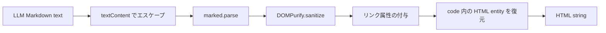

# Phase 4: Markdown/XSS と静的整合性テスト導入手順

## 1. 目的と完了範囲

この手順は [`TESTING_PLAN_PERSONAL.md`](./TESTING_PLAN_PERSONAL.md) の実装順序 4
「XSS と静的整合性」を実施するためのものです。既に導入済みの Vitest と provider contract
テストを維持したまま、LLM 出力を HTML として表示する境界の安全性、および配布物の静的な
整合性を実 API・実ブラウザーなしで検証します。

この Phase で実現すること:

- `convertMarkdownToHtml()` が代表的な XSS payload を安全に処理することを回帰テストで固定する。
- 通常の Markdown、リンク属性、code block の既存表示契約をテストで保護する。
- Chrome / Firefox manifest の version 一致を検証する。
- manifest が参照する extension 内ファイルの存在を検証する。
- 英語 locale を基準に、各 locale の message key が一致することを検証する。
- すべてを `npm test` で実行できる状態にする。

この Phase で実現しないこと:

- DOMPurify、marked、Readability など vendored library 自体の網羅的テスト。
- popup、results、options の全 DOM 表示分岐のテスト。
- `chrome.*` API を含む integration テスト。
- Chromium E2E、実 API smoke、Firefox 自動化。
- Markdown の仕様変更、sanitize 方針の変更、リンク表示 UX の変更。
- manifest の内容を Chrome / Firefox のスキーマで完全に検証すること。

これは現行の挙動を固定する characterization テストである。脆弱性や不自然な表示を見つけた場合も、
この Phase の抽出・テスト導入と同時に修正しない。再現テストを追加してから、別変更として修正する。

## 2. 対象コードと現行契約

### 2.1 Markdown 表示境界

対象は `extension/utils.js` の公開 helper である。

```text
convertMarkdownToHtml(content, breaks, links)
```

現行の処理は、次の順序で行われる。



守るべき観測可能な契約は以下である。

`textContent` による事前エスケープは、この関数の第一の安全層である。入力に直接含まれる生 HTML は、
まず text として扱われ、その後に Markdown 変換と sanitize を通る。

- 通常の heading、list、code block を HTML へ変換する。
- `links` が有効なら、生成されたリンクに `target="_blank"` と
  `rel="noopener noreferrer"` を付与する。
- `links` が無効なら、renderer によりリンクの text のみを残す。
- script、event handler、`javascript:` URL、危険な SVG 系 payload を最終 HTML に残さない。
- code 要素内の `&lt;`、`&gt;`、`&amp;` は既存どおり元の文字へ戻す。

`convertMarkdownToHtml()` は `document`、global の `marked`、global の `DOMPurify` に依存する。
現在の Node 環境のままでは直接テストできないため、この Phase で jsdom を開発依存に追加する。

### 2.2 静的整合性の対象

対象となる配布設定は次のとおりである。

- `extension/manifest.json`
- `firefox/manifest.json`
- `extension/_locales/en/messages.json`
- `extension/_locales/*/messages.json`

現時点で Chrome / Firefox manifest の `version` は一致している。テストでは特定の
version 値ではなく、両者が一致することを検証する。

manifest の参照先として最低限確認するもの:

- `icons` の各 path
- `action.default_popup`
- `background.service_worker` または `background.scripts`
- `options_page`
- content script の `js` / `css`（定義されている場合）

locale は英語を基準とし、各 locale が英語と同じ key 集合を持つことを確認する。各 message の
翻訳品質、description の有無、並び順、文字列内容は対象外とする。

## 3. 実装前の確認

作業開始前にリポジトリ root で次を確認する。

1. `npm run lint` が成功する。
2. `npm test` が成功する。
3. `extension/utils.js` の `convertMarkdownToHtml()` を読み、上記の現行契約と相違がない。
4. `extension/manifest.json`、`firefox/manifest.json`、英語 locale の構造を確認する。
5. fixture・test data に API key、Authorization header、実会話、個人情報、非公開 URL を含めない。
6. 関係ない機能変更を同じ変更へ混在させない。

jsdom は実 Chromium ではない。DOMPurify の動作や URL の正規化には差異があり得るため、ここでの
合格は「本プロジェクトの Markdown 変換設定が代表 payload を安全に処理すること」である。
実ブラウザーでの確認は後続の最小 E2E またはリリース前 smoke で補う。

## 4. 変更するファイル

標準的には次のファイルを変更・追加する。

| ファイル | 変更内容 |
| --- | --- |
| `package.json` | `jsdom` を開発依存に追加する。必要なら DOM テスト用 script を追加するが、通常は既存の `npm test` を使う。 |
| `eslint.config.mjs` | テストの環境設定を確認する。jsdom テストに browser globals が必要なら test 用設定だけを最小追加する。 |
| `test/helpers/dom-markdown.js` | jsdom と vendored marked / DOMPurify のロード、global の install / restore を行う最小 helper を追加する。 |
| `test/dom/markdown.test.js` | jsdom、marked、DOMPurify を使う `convertMarkdownToHtml()` の回帰テストを追加する。 |
| `test/static/extension-integrity.test.js` | manifest version、参照ファイル、locale key を検証する Node テストを追加する。 |
| `extension/utils.js` | 原則変更しない。テストで現行挙動を固定する。 |

`extension/lib/` は第三者ライブラリであり、直接編集しない。テスト用に別の npm package を導入して
ライブラリの本番実装を置き換えることもしない。DOM テストでは、現在 vendored されている
`extension/lib/marked.umd.min.js` と `extension/lib/purify.min.js` を jsdom window へ読み込む。

## 5. jsdom と vendored library のテスト setup

### 5.1 jsdom 導入

1. `jsdom` を dev dependency として追加する。
2. `test/dom/` を作成する。
3. テストごとに新しい `JSDOM` instance を作り、終了時に `window.close()` する。
4. 元の `globalThis.document`、`globalThis.window`、`globalThis.DOMPurify`、`globalThis.marked` を保存し、`afterEach()` で正確に復元する。もともと未定義のものは `delete` で除去し、定義済みのものは元の値へ戻す。
5. DOM state をテスト間で共有しない。

Vitest の Node environment を維持してよい。テストファイル単位で jsdom を生成すると、既存の
provider contract テストに DOM global が漏れない。

### 5.2 本番と同じ Markdown / sanitize 実装を読み込む

`convertMarkdownToHtml()` は global `marked` と `DOMPurify` を参照するため、テスト setup では
次のように本番と同じ vendored build を jsdom context で評価する。

1. `extension/lib/marked.umd.min.js` を text として読む。
2. `extension/lib/purify.min.js` を text として読む。
3. `marked` と `DOMPurify` は独立しているため、評価順はどちらでもよい。helper 内では順序を固定し、毎回同じ手順で評価する。
4. `window.marked` と `window.DOMPurify` を対応する global へ設定する。
5. `extension/utils.js` から `convertMarkdownToHtml()` を import して呼び出す。

評価方法はテスト実行環境に適したものを選ぶ。重要なのは、Node 用の別 version ではなく、
配布対象と同じ minified build を使用し、`extension/lib/` を変更しないことである。

test helper を `test/helpers/dom-markdown.js` に置き、責務を以下に限定する。

- jsdom の作成・破棄。
- vendored marked / DOMPurify のロード。
- global の install・restore。
- HTML を DOM として query する小さな補助。

XSS payload、期待値、個々の assertion は `markdown.test.js` 側に置く。helper にテスト仕様を
隠さない。

## 6. Markdown/XSS 回帰テストの実装

### 6.1 テストの書き方

HTML 文字列の完全一致は、marked / DOMPurify の library 更新で不要に壊れやすい。次を優先する。

- `JSDOM` で出力 HTML を parse し、危険な node / attribute / URL がないことを確認する。
- 安全な要素、text content、リンク属性、code の text content を確認する。
- 同じ payload のテスト内で「存在してはいけないもの」と「保持されるべきもの」を明示する。

ただし link の `rel` 属性と code block の entity 復元は本プロジェクト独自の後処理であるため、
この 2 点は明示的な値比較で固定する。

### 6.2 必須ケース

以下をすべて `test/dom/markdown.test.js` に追加する。テスト名は内部実装名ではなく、出力として
保証したい安全性を書く。

#### M-01: 通常の Markdown と code block を表示する

入力には heading、list、inline code、fenced code block を含める。

確認事項:

- heading と list が生成される。
- code block の text content が期待どおりである。
- code 内の `<`、`>`、`&` が文字として読める。
- `breaks` が true / false の代表ケースで、既存の marked 設定に沿った改行の扱いになる。

#### M-02: script を実行可能な HTML として残さない

`<script>alert(1)</script>` を含む Markdown を渡す。

このケースでは、入力に直接含まれる生 HTML が `textContent` により先にエスケープされ、marked に
実行可能な HTML として渡らないことを確認する。

確認事項:

- 出力 DOM に `script` 要素がない。
- 出力 HTML に実行可能な script tag が含まれない。
- 無害な周辺 text の扱いは現行挙動を characterization として確認する。

#### M-03: event handler attribute を残さない

``、`<div onclick="alert(1)">` のような入力を渡す。

このケースでも、入力に直接含まれる生 HTML が `textContent` により先にエスケープされ、event
handler を持つ要素として marked に渡らないことを確認する。

確認事項:

- `img` や `div` が event handler を持つ live DOM 要素として生成されない。
- `onerror`、`onclick` など `on` で始まる attribute が残らない。
- 無害な周辺 text の扱いは現行挙動を characterization として確認する。

#### M-04: `javascript:` URL をリンクに残さない

`[危険](javascript:alert(1))` と、通常の `https:` link を同時に渡す。

このケースでは、marked が生成した link HTML に対して DOMPurify が危険な protocol を除去し、
その後で `convertMarkdownToHtml()` の後処理が `target` / `rel` を付与することを切り分けて確認する。

確認事項:

- `javascript:` を持つ `a[href]` が存在しない。
- 安全な `https:` link は存在する。
- links 有効時の安全 link に `target="_blank"` と `rel="noopener noreferrer"` が付く。

#### M-05: SVG / data URL を含む代表 payload を安全に処理する

`<svg onload="alert(1)">`、`[危険リンク](data:text/html,alert)`、``
などの代表 payload を渡す。

このケースでは、入力に直接含まれる SVG のような生 HTML は `textContent` により先にエスケープされ、
Markdown 構文から生成された `data:` URL の link / image は DOMPurify により sanitize されることを
切り分けて確認する。

確認事項:

- raw SVG が live DOM 要素として生成されない。
- script 実行につながる SVG attribute や危険 URL が残らない。
- `a[href]` と `img[src]` の両方について、危険な attribute / protocol が残っていないことを確認する。
- Markdown 構文から生成された link / image については、要素の有無そのものではなく sanitize 後の属性だけを検証する。

#### M-06: links 無効時はリンク text のみを残す

`links` に false を渡し、Markdown link を含む input を使う。

確認事項:

- `a` 要素が生成されない。
- link text は出力 text content に残る。
- URL 文字列が意図せず表示されない現行挙動を確認する。

#### M-07: code 要素では文字を復元し、HTML として解釈しない

`<tag>&value` を含む fenced code block を渡す。

確認事項:

- code block の text content が `<tag>&value` である。
- code block 内に `tag` HTML element が生成されない。
- inline code にも同じ後処理が適用される現行挙動を、代表ケース 1 件で characterization として確認する。
- entity 復元が code block の外側へ影響しない。

実装は `&lt;`、`&gt;`、`&amp;` の順に復元するため、二重エスケープの扱いには順序依存の現行挙動がある。
この Phase ではその仕様を変更せず、代表ケースを固定する。

### 6.3 payload 管理の規則

- payload は短く、意図が分かる架空文字列にする。
- 実際の exploit 集を丸ごとコピーしない。script、event handler、protocol、SVG の代表ケースで十分である。
- 1 件の payload が失敗したとき、原因が sanitize、renderer、後処理のどこか分かるようにする。
- library の出力細部に依存する snapshot は作らない。

## 7. 静的整合性テストの実装

### 7.1 Node テストの共通方針

`test/static/extension-integrity.test.js` は DOM / browser を使わない Node テストとする。
`node:fs/promises`、`node:path`、`import.meta.url` を使い、repository root から相対的に
対象ファイルを読む。

test は配布物を変更しない。manifest / locale を読み込んで検証するだけにし、テスト中に version、
locale、生成物を書き換えない。

### 7.2 S-01: Chrome / Firefox manifest version の一致

1. `extension/manifest.json` と `firefox/manifest.json` を JSON として parse する。
2. 両方の `version` が string で空でないことを確認する。
3. 両者が完全一致することを確認する。

version の値をテストにハードコードしない。リリース時に version を更新しても、両 manifest が同時に
更新されていればテストは通る。

### 7.3 S-02: manifest が参照する file の存在

manifest ごとに以下を集め、各 path が extension root 内の file として存在することを確認する。

- `icons` object の path。
- `action.default_popup`。
- `background.service_worker`。
- `background.scripts` の全要素。
- `options_page`。
- `content_scripts` がある場合の各 `js` / `css`。

実装上の注意:

- manifest path は `/` 区切りとして扱い、platform 固有 separator と混在させない。
- path traversal（`..`）が extension root 外を指さないことも確認する。
- `manifest.json` 自身、locale message、URL、permission 名は file 参照ではないため対象に含めない。
- directory ではなく file であることを確認する。

Firefox manifest の source は extension root にある shared source file を参照する。そのため、Firefox
manifest をテストするときも参照 path の解決 root は `firefox/` ではなく `extension/` とする。

### 7.4 S-03: locale key の一致

1. `extension/_locales/en/messages.json` を parse して基準 key を得る。
2. `extension/_locales/` の各 locale directory の `messages.json` を読み込む。
3. 各 locale の key 集合が英語 locale の key 集合と完全一致することを確認する。
4. 失敗時には、欠けている key と余分な key を表示して修正箇所を特定できるようにする。

key の並び順は比較しない。message object の `message` 値が string か、翻訳が自然か、英語と同じ
値かはこの Phase の対象外である。

### 7.5 任意: manifest の最小必須項目

S-01〜S-03 が安定してから、次だけを追加してよい。

- `manifest_version === 3`。
- `default_locale === "en"`。
- `background.type === "module"`。

browser 固有の manifest schema 全体を手作業で模倣しない。詳細なスキーマ検証を導入する必要が
生じたときは、別の Phase / 変更で公式 validator 等を検討する。

## 8. 実装順序

1. **現状確認**
   - `npm run lint`、`npm test` を実行する。
   - `convertMarkdownToHtml()`、2 つの manifest、英語 locale を確認する。
2. **DOM テスト基盤の追加**
   - `jsdom` を dev dependency に追加する。
   - vendored marked / DOMPurify を jsdom でロードする最小 helper を追加する。
   - global restore を `afterEach()` で確実に実行する。
3. **Markdown の通常表示テスト**
   - M-01、M-06、M-07 を追加する。
   - テストが現在の本番 library と `convertMarkdownToHtml()` を通っていることを確認する。
4. **XSS 回帰テスト**
   - M-02〜M-05 を追加する。
   - 失敗時は library を直接編集せず、payload、setup、現行の sanitize 設定を確認する。
5. **静的整合性テスト**
   - S-01、S-02、S-03 を追加する。
   - version や locale の既存値を変更せず、検証だけを追加する。
6. **最終検証**
   - `npm run lint` と `npm test` を実行する。
   - 新規テストがネットワーク、実 API、実ブラウザーに依存しないことを確認する。

## 9. 失敗時の切り分け

| 失敗 | 最初に確認すること | この Phase でしないこと |
| --- | --- | --- |
| jsdom テストで global が未定義 | setup 順序、vendored build のロード、`afterEach()` の restore、未定義 global の `delete` 復元 | production code にテスト専用 global 分岐を入れること |
| script / event handler / SVG が残る | `textContent` による事前エスケープが有効か、input が生 HTML ではなく text として marked に渡っているか | `extension/lib/` を手編集すること |
| `javascript:` URL や `data:` URL が残る | DOMPurify による危険 protocol 除去が本番 build と同じ context で動いているか、出力 DOM の `a[href]` / `img[src]` が sanitize 後のものか | post-process だけで安全性を担保しようとすること |
| safe link の属性がない | `links` 引数、出力 DOM の `a[href]`、post-process の実行 | 属性要件を削除してテストを緩めること |
| manifest file 存在テストが失敗 | 解決 root、manifest の path、file / directory の区別 | テストの対象から参照を除外すること |
| locale key テストが失敗 | 欠けた key、余分な key、locale file の JSON 構文 | 英語基準を変更して失敗を隠すこと |

既存の本番バグを発見した場合は、テストを削除・緩和して通すのではなく、現行挙動を再現するテストと
修正方針を分離する。修正を行う場合は、XSS payload が安全になることに加え、M-01、M-06、M-07 の
通常表示が維持されることを確認する。

## 10. 完了条件

以下をすべて満たしたとき、Phase 4 は完了とする。

- `convertMarkdownToHtml()` を本番と同じ marked / DOMPurify build と jsdom で実行するテストがある。
- script、event handler、`javascript:` URL、SVG / data URL の代表 payload が危険な HTML として残らないことを検証している。
- 通常 Markdown、リンクの `target` / `rel`、links 無効時、code block の既存挙動を検証している。
- Chrome / Firefox manifest の version 一致を検証している。
- manifest が参照する extension file の存在を検証している。
- 全 locale の key 集合が英語 locale と一致することを検証している。
- `npm run lint` と `npm test` が成功する。
- テストは実 API、外部 Web サイト、実時間待機、実ブラウザーに依存しない。

## 11. 後続作業

Phase 4 完了後、個人向け計画の次段階は最小 Chromium E2E である。そこでローカル mock API を使い、
要約実行、結果表示、follow-up の 1 本の主要経路を確認する。

Markdown の DOM テストは E2E を置き換えるものではない。特に browser 固有の URL 処理、extension
page 上での library 読み込み、実 service worker との連携は、E2E またはリリース前の Chrome、Edge、
Firefox 手動 smoke で確認する。
