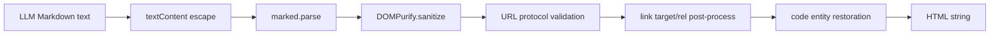

# Phase 4a: Markdown URL protocol hardening 導入手順

## 1. 目的と背景

[`TESTING_PHASE_4.md`](./TESTING_PHASE_4.md) の characterization test により、現在 vendored している
DOMPurify build を jsdom で実行した場合、Markdown link の `data:text/html,...` は `href` を失う一方、
Markdown image の `data:text/html,...` は `img[src]` に残ることが確認された。

この Phase は、その発見を別変更として安全化するためのものである。Phase 4 のテスト基盤導入・
静的整合性テストとは分離し、`convertMarkdownToHtml()` の URL 属性を対象とした最小の production
変更と回帰テストだけを扱う。

この Phase で実現すること:

- Markdown から生成された `a[href]` と `img[src]` に許可する URL protocol を明示する。
- `javascript:` と `data:` を含む危険な URL を最終 HTML のリンク・画像属性に残さない。
- 正常な URL と既存のリンク属性・code 表示が維持されることを回帰テストで確認する。
- `npm run lint` と `npm test` を成功させる。

この Phase で実現しないこと:

- `extension/lib/` の DOMPurify / marked を更新または直接編集すること。
- DOMPurify の全 sanitize 設定を置き換えること。
- SVG、CSS、iframe、style 属性など、URL protocol 以外の HTML sanitize 方針を再設計すること。
- Markdown の一般仕様、リンク表示 UX、popup / results の DOM 分岐を変更すること。
- 実ブラウザー E2E や実 API 呼び出しを導入すること。

## 2. 対象と安全性方針

対象は `extension/utils.js` の次の公開 helper である。

```text
convertMarkdownToHtml(content, breaks, links)
```

現行の基本処理は維持する。



DOMPurify は第一の sanitize 層として残す。Phase 4a では、DOMPurify 後の DOM に存在する URL 属性を
検査する最小の post-process を追加する。

### 2.1 許可する protocol

初期実装では、次を許可する。

| 要素・属性 | 許可する protocol |
| --- | --- |
| `a[href]` | `http:`, `https:` |
| `img[src]` | `http:`, `https:` |

相対 URL、protocol-relative URL、`blob:`、`data:`、`javascript:`、`mailto:`、`tel:`、空でない不正 URL は、
この Phase では許可しない。特に `data:` は画像形式であっても許可しない。URL の protocol は、base URL で
補完せず、入力値そのものから判定する。

許可しない protocol を検出した場合は、要素全体ではなく該当する `href` または `src` 属性だけを除去する。
これにより Markdown の link text と image の `alt` text は保持する。

### 2.2 互換性の対象

次の既存契約を維持する。

- `links === true` の安全な `a[href]` に `target="_blank"` と
  `rel="noopener noreferrer"` が付く。
- `links === false` の Markdown link は text のみになる。
- heading、list、inline code、fenced code block の変換は変えない。
- code 要素内の `&lt;`、`&gt;`、`&amp;` の既存の復元処理は変えない。
- 無効な URL の link text、image の `alt` text は表示に残る。

## 3. 変更対象

| ファイル | Phase 4a での変更 |
| --- | --- |
| `extension/utils.js` | DOMPurify 後の `a[href]` / `img[src]` を検査し、非許可 protocol の属性を除去する最小 helper と post-process を追加する。 |
| `test/dom/markdown.test.js` | `data:` image URL を含む M-05 を、安全でない `src` が残らない期待値へ変更する。safe URL と既存表示契約の回帰 assertion を追加する。 |
| `docs/TESTING_PHASE_4a.md` | この手順書。 |

原則として `package.json`、jsdom helper、vendored library、manifest、locale は変更しない。

## 4. 実装前の確認

1. `npm run lint` と `npm test` が成功することを確認する。
2. `extension/utils.js` の `convertMarkdownToHtml()` と、Phase 4 で追加した
   `test/dom/markdown.test.js` を読む。
3. 現在の M-05 が `data:text/html,...` image の `src` が残る現行挙動を
   characterization として固定していることを確認する。
4. この文書で定義した allowlist と、相対 URL を拒否する方針を実装前に確認する。
5. test data に API key、Authorization header、実会話、個人情報、非公開 URL を含めない。

## 5. 実装順序

1. **現状の再現を確認する**
   - Phase 4 の Markdown test を実行し、`data:text/html,...` image の `src` が
     現行挙動として残ることを確認する。
2. **失敗する安全性テストを先に更新する**
   - M-05 の image assertion を「`data:` の `src` がない」へ変更する。
   - `javascript:` image、`data:` link、safe `https:` image / link を代表ケースとして加える。
   - 相対 URL、protocol-relative URL、`blob:`、不正 URL、`mailto:`、`tel:` についても、
     非許可属性が除去される代表ケースを追加する。
   - この時点ではテスト失敗を確認する。
3. **最小の production hardening を実装する**
   - DOMPurify の出力 DOM を走査し、allowlist 外の `href` / `src` 属性を削除する。
   - URL 解析失敗時は安全側に倒して属性を削除する。
   - `target` / `rel` の付与は、`href` が残る安全な link のみに適用されることを維持する。
4. **通常表示を回帰確認する**
   - M-01、M-06、M-07 と safe link の表示を実行する。
   - link text、image alt text、code text が維持されることを確認する。
5. **最終検証を実行する**
   - `npm run lint` と `npm test` を実行する。
   - テストがネットワーク、実 API、実時間待機、実ブラウザーへ依存しないことを確認する。

## 6. 回帰テスト

Phase 4 の `test/dom/markdown.test.js` を拡張または更新し、少なくとも次を確認する。

| ID | 入力例 | 確認事項 |
| --- | --- | --- |
| H-01 | `[safe](https://example.test/path)` | `href`、`target="_blank"`、`rel="noopener noreferrer"` が残る。 |
| H-02 | `` | `img[src]` が残る。 |
| H-03 | `[bad](javascript:alert(1))` | `a` に `href` が残らず、link text は残る。 |
| H-04 | `[bad](data:text/html,alert)` | `a` に `href` が残らず、link text は残る。 |
| H-05 | `)` | `img` に `src` が残らず、alt text は残る。 |
| H-06 | `` | `img` に `src` が残らず、alt text は残る。 |
| H-07 | existing M-01 / M-06 / M-07 | 通常 Markdown、links 無効、code entity 復元が変わらない。 |
| H-08 | `[relative](/path)` / `` | `a[href]` / `img[src]` が残らない。 |
| H-09 | `[protocol-relative](//example.test/path)` / `` | `a[href]` / `img[src]` が残らない。 |
| H-10 | `[bad](blob:example)` / `` | `a[href]` / `img[src]` が残らない。 |
| H-11 | `[mail](mailto:user@example.test)` / `[call](tel:+12025550123)` | `a[href]` が残らず、link text は残る。 |
| H-12 | `[safe](http://example.test/path)` / `` | `href` / `src` が残る。link には `target="_blank"` と `rel="noopener noreferrer"` が付く。 |

HTML 文字列全体の snapshot や完全一致は避ける。出力を jsdom で parse し、要素、属性、text content を
確認する。`target` と `rel`、危険属性の不在だけは明示比較してよい。

## 7. 完了条件

次をすべて満たしたとき Phase 4a は完了とする。

- Markdown 由来の `a[href]` と `img[src]` に protocol allowlist が適用されている。
- `javascript:`、`data:`、`blob:`、`mailto:`、`tel:`、相対 URL、protocol-relative URL、不正 URL が、
   `a[href]` または `img[src]` に残らないことを検証している。
- safe `http:` / `https:` link / image と既存の link `target` / `rel` が維持されることを検証している。
- links 無効、通常 Markdown、code entity 復元の既存契約が維持されている。
- `extension/lib/` を変更していない。
- `npm run lint` と `npm test` が成功する。
- テストは実 API、外部 Web サイト、実時間待機、実ブラウザーに依存しない。

## 8. 後続作業

Phase 4a の完了後、Phase 4 の M-05 にある SVG / data URL の安全性要件を満たす。
次の実装段階は、最小 Chromium E2E の計画と実装である。E2E では URL protocol の browser 差異、
extension page での library 読み込み、service worker 連携を必要最小限の主要経路で補完する。
