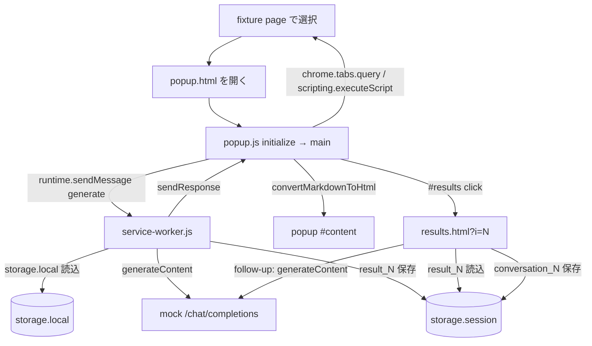

# Phase 5: 最小 Chromium E2E 導入手順

## 1. 目的と完了範囲

この手順は [`TESTING_PLAN_PERSONAL.md`](./TESTING_PLAN_PERSONAL.md) の実装順序 6
「最小 Chromium E2E」を実施するためのものです。Phase 1〜4a で Vitest により保護した
provider 境界、streaming、retry/fallback、Markdown sanitize、静的整合性を維持したまま、
実 Chromium、unpacked extension、Manifest V3 service worker を含む 1 本の主要経路を
ローカル mock API で検証します。

この Phase で実現すること:

- Playwright の persistent context に `extension/` 由来の unpacked extension をロードする。
- ローカル fixture ページとローカル mock OpenAI 互換 API を同一の Node プロセス内 server で提供する。
- テキスト選択からの要約実行、popup での結果表示、results ページでの結果表示と
  follow-up、reload 後の会話復元を 1 シナリオで確認する。
- mock server が受け取った request の回数と主要 field（model、messages 構造）を検証する。
- `npm run test:e2e` で既存の `npm test`（Vitest）から分離して実行できる状態にする。
- 実 API、外部 Web サイト、固定時間の待機を使わない。

この Phase で実現しないこと:

- streaming、retry/fallback、画像入力、YouTube 字幕、cache hit、context menu、
  keyboard shortcut、options UI 操作を含む E2E シナリオの追加。
- Edge / Firefox の自動化、実 API smoke の自動化。
- popup / results / options の全表示分岐の検証。
- Vitest の contract test で既に保証している request / response 変換の詳細な再検証。
- E2E を PR 必須チェックに組み込むこと（安定してから別変更で行う。
  [`TESTING_PLAN_PERSONAL.md`](./TESTING_PLAN_PERSONAL.md) §6 を参照）。
- 本番コード、manifest、vendored library の変更。

この Phase の E2E は、Vitest のテストを置き換えるものではない。LLM の wire contract、
chunk 境界、sanitize などの詳細は引き続き Vitest が担い、E2E は「実ブラウザーで
extension 本体・service worker・storage・ページ抽出が繋がること」だけを保証する。

## 2. 対象シナリオと現行の実行経路

### 2.1 検証する 1 シナリオ

1. fixture ページを開き、既知の段落を選択する。
2. popup ページを開く（popup は表示と同時に要約を自動実行する）。
3. mock OpenAI 互換 endpoint が固定応答を返し、popup `#content` に要約が表示される。
4. popup の「Open results in a new tab」から results ページを開き、要約と元ページの
   title が表示される。
5. results ページで follow-up を送信し、質問と回答が `#conversation` に表示される。
6. results ページを reload し、session storage から会話が復元される。

### 2.2 現行の実行経路

初回生成と follow-up は異なる経路を通る。E2E はこの両方を 1 シナリオで跨ぐ。



シナリオが依存する観測ポイント:

| 地点 | 確認に使うもの |
| --- | --- |
| popup 結果表示 | `#content` の text、popup が `chrome.runtime.sendMessage({ message: "generate" })` を送ること |
| mock request | mock server が記録する method、path、header、JSON body |
| results 結果表示 | `#content`、`#page-source-title`（fixture ページの `<title>`） |
| follow-up | `#text`、`#send`、`#conversation`、mock の 2 件目 request の `messages` |
| 会話復元 | reload 後の `#conversation`（`conversation_N` は `chrome.storage.session` 由来） |

`resultIndex` は新規 profile では 0 から始まるが、テストは index 値に依存せず、
`#results` click 後に開かれる tab を `waitForEvent("page")` で捕捉する。

## 3. E2E 環境の設計

Phase 5 の実装に入る前に、以下の設計判断を確認する。いずれも「実ブラウザーで
主要経路を決定論的に再現し、本番コードを変更しない」ことを基準に決めたものである。

### 3.1 Playwright と persistent context

- dev dependency に `@playwright/test` を追加し、Chromium は
  `npx playwright install chromium` で取得する。
- `chromium.launchPersistentContext()` を使い、
  `--disable-extensions-except=<dir>` と `--load-extension=<dir>` で extension をロードする。
- extension のロードには新 headless（`channel: "chromium"`）を使う。古い headless は
  extension をサポートしない。デバッグ時だけ環境変数で `headless: false` に切り替えられる
  ようにしてよい。
- user data directory は実行ごとに新規の一時 directory とし、storage・cache・profile を
  テスト間で共有しない。
- extension ID は unpacked extension の path 由来であり一時 directory ごとに変わるため、
  ハードコードせず、起動後の service worker の URL から取得する。

### 3.2 テスト用 manifest を持つ一時 extension コピー

本番 manifest は `activeTab` 等の permissions と `http://*/*`、`https://*/*` の
optional host permissions を持ち、localhost への host permission は既定で付与されない。
ユーザー操作を伴わない自動テストでは、次の API が host access を要求する。

- `chrome.scripting.executeScript()`（fixture ページからの選択テキスト取得）
- extension から mock server `http://127.0.0.1:<port>` への `fetch()`

この Phase では選択テキスト経路のみを対象にするため、`chrome.tabs.captureVisibleTab()`
（抽出失敗時の image fallback）はこの seam では扱わない。`captureVisibleTab()` は
`<all_hosts>` 相当の広い host access に依存し、本番 manifest の `activeTab` と
`optional_host_permissions` だけでは自動テストで成立しない。image fallback 経路は
別 Phase で権限設計から検討し直すまで E2E 対象外とする。

permission dialog は Playwright から操作できないため、実ユーザーによる許可経路は
この Phase の自動化対象外とする。代わりに、global setup で次を行う。

1. `extension/` を一時 directory へ再帰コピーする。
2. コピーした `manifest.json` にだけ `"host_permissions": ["http://127.0.0.1/*"]` を追加する。
3. persistent context にはこの一時コピーをロードする。

これは本番 artifact を変更せず、差分をテストコード内の 1 か所に明示するための seam であり、
本番 manifest への host permissions 追加ではない。host pattern は port を含まないため、
mock server は ephemeral port を使える。host permission 付きの extension からの fetch は
CORS の対象外になるため、mock server への request もこの差分で成立する。

テストの結論はあくまで通常経路（popup、service worker、storage、results）についての
ものであり、optional host permission の許可 UI 自体はリリース前の手動 smoke に残す。

### 3.3 ローカル mock server（fixture ページと API を同居）

`node:http` を使う小さな server を Playwright の test プロセス内で起動する。

- `GET /article.html` — 既知の段落と `<title>` を持つ fixture ページを返す。
- `POST /chat/completions` — OpenAI 互換形式の固定 JSON を返し、request を記録する。
- `OPTIONS` — 204 を返す（host permission 適用で通常は到達しないが、防御的に扱う）。
- 上記以外 — 404。

設計上の要件:

- `server.listen(0)` で ephemeral port を使い、port 競合を避ける。
- response 内容は呼び出し順に queue から取り出す（1 件目: 要約、2 件目: follow-up 回答）。
- 受け取った request の method、path、header、parse 済み body を配列に保持し、
  テストから参照できるようにする。
- 応答本文・fixture 本文は短い架空の文字列のみとし、実 API の応答、実記事、
  API key、個人情報、非公開 URL を含めない。
- 外部ネットワークへは一切接続しない。`127.0.0.1` のみで listen する。

### 3.4 設定の投入

extension の設定は options UI を操作せず、起動済みの service worker から直接投入する。

```text
worker.evaluate(() => chrome.storage.local.set({ ... }))
```

投入する代表値:

| key | 値 |
| --- | --- |
| `apiProvider` | `"openai"` |
| `openaiApiKey` | `"test-api-key"`（ダミー） |
| `openaiBaseUrl` | `http://127.0.0.1:<port>`（mock server の origin） |
| `openaiModelId` | `"gpt-test"`（架空の model ID） |
| `streaming` | `false` |
| `textAction` | `"summarize"`（既定は `"translate"` のため明示する） |
| `languageCode` | `"en"` |

OpenAI 互換 API を最初の E2E に使うのは、Base URL をローカル mock server へ向けられる
ためである。Gemini 固有の wire contract は Phase 2 / 3 の contract test で保証済みであり、
E2E で重複して検証しない。

### 3.5 `chrome.tabs.query` の決定論的な stub

popup.js は `chrome.tabs.query({ active: true, currentWindow: true })` で対象 tab を
決定する。popup.html を tab として開くと、開いた瞬間にその tab が active になり、
window の active 状態への依存と初期化の race が生じる。これは headless 環境で不安定な
ため、popup page に限り次の init script を注入する。

- `chrome.tabs.query({ active: true, currentWindow: true })` だけを横取りし、
  fixture tab の `{ id, url, title, windowId, active: true }` を返す。
  `windowId` は popup.js が抽出失敗時に `chrome.tabs.captureVisibleTab(tab.windowId, ...)`
  で読むため、選択経路だけでなく fallback 側で未定義参照にならないよう含める。
- それ以外の query 呼び出しは元の実装へ委譲する。

fixture tab の ID は、service worker から `chrome.tabs.query({ url: ... })` で取得する。
この stub は popup page の tab 解決だけを固定する最小の seam であり、scripting、
storage、runtime message、fetch はすべて本物の API を通す。

### 3.6 待機と安定性の規則

- 固定時間の `sleep` / `waitForTimeout` を使わない。Playwright の自動待機、
  `expect().toContainText()` の polling、`waitForEvent("page")` /
  `waitForEvent("serviceworker")` を使う。
- popup / results の `pageerror` イベントを収集し、未捕捉例外があればテストを失敗させる。
- mock 応答の本文は fixture であるため断片の一致を検証してよいが、HTML 全体の
  snapshot や、library の出力細部への依存は避ける。
- 1 シナリオの中で assertion を段階的に置き、失敗時に要約・結果表示・follow-up・
  復元のどの段階かを特定できるようにする。

## 4. 実装前の確認

作業開始前にリポジトリ root で次を確認する。

1. `npm run lint` が成功する。
2. `npm test` が成功し、Phase 1〜4a のテストがすべて通る。
3. Playwright の browser 取得と E2E 実行に必要なローカル権限がある。
   （`npx playwright install chromium` が 1 回だけネットワークアクセスを必要とする。
   通常の `npm test` / `npm run test:e2e` はネットワークに接続しない。）
4. `extension/popup.js`、`extension/service-worker.js`、`extension/results.js` の
   現在の経路が §2.2 の説明と一致することを読んで確認する。
5. fixture・test data に API key、Authorization header の実値、実会話、個人情報、
   非公開 URL を含めない。
6. 関係ない機能変更を同じ変更へ混在させない。

E2E の flaky 化を避けるため、§3 の設計判断（一時 extension コピー、tabs.query stub、
設定の service worker 投入）から外れたい場合は、先に理由を記録してから実装する。

## 5. 変更・追加するファイル

| ファイル | 変更内容 |
| --- | --- |
| `package.json` | `@playwright/test` を dev dependency に追加し、`test:e2e` script を追加する。 |
| `package-lock.json` | npm install により更新する。 |
| `vitest.config.js` | 新規追加。`e2e/**` を Vitest の対象から除外する。 |
| `eslint.config.mjs` | `e2e/**/*.js` に Node.js globals を追加する。 |
| `.gitignore` | Playwright の出力 directory を追加する。 |
| `e2e/playwright.config.js` | Playwright の最小設定を追加する。 |
| `e2e/helpers/local-server.js` | fixture ページと mock `/chat/completions` を提供する server helper を追加する。 |
| `e2e/helpers/extension-context.js` | 一時 extension コピー、persistent context 起動、service worker 取得、設定投入、popup stub に渡す tab metadata 取得を行う helper を追加する。 |
| `e2e/fixtures/article.html` | 既知の選択対象段落と `<title>` を持つ fixture ページを追加する。 |
| `e2e/specs/main-flow.spec.js` | §2.1 の 1 シナリオを検証する Playwright test を追加する。 |
| `AGENTS.md` | Validation セクションに `test:e2e` の位置づけ（PR 必須ではなく main / リリース前）を追記する。 |
| `docs/TESTING_PLAN_PERSONAL.md` | Phase 5 の手順書リンクをこの文書へ更新する。 |
| `extension/` | 原則変更しない。一時コピーのみがテストで使われる。 |

`test/` 配下の既存 Vitest 資産（`fetch-mock.js`、`chrome-storage-mock.js` 等）は
E2E から参照しない。E2E の helper は `e2e/` 内に閉じて置く。

## 6. 環境構築

### 6.1 依存関係と script

1. `@playwright/test` を dev dependency として追加する。
   `npm install --save-dev` を使い、version を手で固定・編集しない。
2. `npx playwright install chromium` で browser を取得する（初回のみ）。
3. `package.json` の `scripts` に次を追加する。

   | script | 内容 | 用途 |
   | --- | --- | --- |
   | `test:e2e` | `playwright test --config e2e/playwright.config.js` | 最小 Chromium E2E の一回実行 |

   既存の `test`（Vitest）と `test:watch` は変更しない。`npm test` に E2E を混ぜない。

### 6.2 Playwright の最小設定

`e2e/playwright.config.js` を作成し、次の方針だけを設定する。

- `testDir: "./specs"`。
- `workers: 1`（1 シナリオのみ。拡大時も browser 競合を避けるため直列を既定にする）。
- `retries: 0`（flaky な test を retry で隠さない）。
- `reporter: "list"`（report file を生成しない）。
- `outputDir` は既定の `test-results` を使い、`.gitignore` に追加する。
- `timeout` は extension 起動と mock 応答を考慮した現実的な上限を 1 か所に書く。
  assertion ごとの独自 timeout を増やさない。

`baseURL`、trace、screenshot の常時保存は設定しない。失敗調査用の artifact は、
実際に flaky さや失敗へ直面したときに別変更で追加する。

### 6.3 Vitest の除外設定

Vitest の既定の test 検出は `e2e/specs/*.spec.js` も拾ってしまう。
`vitest.config.js` を新規作成し、既定の exclude を維持したまま `e2e/**` を追加する。

```js
import { defineConfig, configDefaults } from "vitest/config";

export default defineConfig({
  test: {
    exclude: [...configDefaults.exclude, "e2e/**"]
  }
});
```

Phase 1 では設定ファイルを作らない方針だったが、test の種類が増えたこの段階で導入する。
環境（Node.js のまま）など他の設定は追加しない。

### 6.4 ESLint の調整

`eslint.config.mjs` に `e2e/**/*.js` 用の block を追加し、`globals.node` を有効にする。
Playwright の `test` / `expect` は `@playwright/test` からの named import であり、
追加の global 定義は不要である。`test/**/*.js` 用の既存設定（Node + Vitest globals）は
変更しない。browser / webextensions globals は既に全ファイルに適用されているため、
init script 内の `chrome` 参照のために新たな設定は要らない。

## 7. テストダブルと fixture の実装

### 7.1 ローカル server helper

`e2e/helpers/local-server.js` は、次の責務だけを持つ最小 API にする。

| helper | 責務 |
| --- | --- |
| `startLocalServer()` | `127.0.0.1` の ephemeral port で listen し、`{ origin, requests, enqueueResponse, stop }` を返す |
| `requests` | 受け取った API request の `{ method, path, headers, body }` の配列。body は parse 済み JSON |
| `enqueueResponse(content)` | 次回以降の `POST /chat/completions` に返す assistant content を queue に追加する |
| `stop()` | server を close する |

`POST /chat/completions` の成功応答は最小の OpenAI chat completion 形式とする。

```json
{
  "id": "chatcmpl-test",
  "object": "chat.completion",
  "created": 0,
  "model": "gpt-test",
  "choices": [
    {
      "index": 0,
      "message": { "role": "assistant", "content": "<enqueue された content>" },
      "finish_reason": "stop"
    }
  ]
}
```

queue が空のときは 500 を返す（テスト側の request 過多を即座に検出するため）。
HTTP server には `node:http` を使い、新しい framework を導入しない。

### 7.2 fixture ページ

`e2e/fixtures/article.html` は、次だけを持つ最小の HTML にする。

- `<title>Test Article</title>`（results の `#page-source-title` 検証に使う）。
- 選択対象の既知段落（例: 一意な 2〜3 文の架空の英文）。
- Readability に依存しない構造（E2E は選択経路のみを使う）。

実在する記事・サイトの文章をコピーしない。

### 7.3 extension context helper

`e2e/helpers/extension-context.js` は、次の責務を持つ。

| helper | 責務 |
| --- | --- |
| `prepareExtensionCopy()` | `extension/` を一時 directory へコピーし、manifest に `host_permissions: ["http://127.0.0.1/*"]` を加えて path を返す |
| `launchExtensionContext()` | 一時 user data directory と上記コピーで persistent context を起動し、`{ context, extensionId, userDataDir }` を返す |
| `getServiceWorker(context)` | 起動済みの service worker を返す（必要なら `waitForEvent("serviceworker")`） |
| `seedOptions(worker, values)` | `chrome.storage.local.set()` を service worker 上で実行する |
| `findTabByUrl(worker, urlPattern)` | `chrome.tabs.query()` で popup stub に渡す tab metadata（`id`、`url`、`title`、`windowId`）を取得する |
| `closeExtensionContext()` | context を閉じ、一時 directory を削除する |

extension ID は service worker の URL（`chrome-extension://<id>/service-worker.js`）から
取り出す。`chrome-extension://` URL をテスト内で文字列結合するときだけ ID を使い、
ID を fixture や期待値に埋め込まない。

### 7.4 popup page 用 init script

spec 側で popup page を作成した直後、navigation 前に `addInitScript()` で
`chrome.tabs.query` の stub を注入する。stub は次の条件を満たす。

- 引数が `{ active: true, currentWindow: true }` を含む場合に限り、fixture tab の
  `{ id, url, title, windowId, active: true }` 1 件を resolve する。
  `windowId` は popup.js が `chrome.tabs.captureVisibleTab(tab.windowId, ...)` で読む
  ため、選択経路のみを検証する今回も含める。これにより fallback 経路を別 Phase で
  拡張するときに stub 仕様を変更せずに済む。
- それ以外の呼び出しは元の `chrome.tabs.query` へそのまま渡す。
- fixture tab の ID・URL・title・`windowId` は `addInitScript` の引数として渡し、
  script 内にハードコードしない。

## 8. E2E シナリオの実装

`e2e/specs/main-flow.spec.js` に 1 本の test として実装する。各段階を `test.step()`
で区切り、失敗位置を特定しやすくする。以下の E-01〜E-06 をすべて満たす。

### E-01: 環境起動と設定投入

1. ローカル server を起動し、要約応答（例: `"1. Alpha point.\n2. Beta point."`）を
   enqueue する。
2. 一時 extension コピーで persistent context を起動し、service worker を取得する。
3. §3.4 の設定値を投入する。

確認事項:

- service worker が取得でき、extension ID が `chrome-extension://` URL から取れる。
- 設定投入が await 完了している（投入前に popup を開かない）。

### E-02: fixture ページとテキスト選択

1. fixture ページ `http://127.0.0.1:<port>/article.html` を開く。
2. `page.evaluate()` で対象段落を `window.getSelection()` で選択する。
3. service worker から `findTabByUrl()` で popup stub に渡す tab metadata
   （`id`、`url`、`title`、`windowId`）を取得する。

確認事項:

- 選択後に fixture page を click などで操作しない（選択が解除されるため）。
- tab metadata が取得できている。

### E-03: popup による要約実行と結果表示

1. popup page を作成し、§7.4 の init script を注入してから
   `chrome-extension://<id>/popup.html` へ遷移する。
2. popup は表示と同時に要約を自動実行するため、`#content` を polling で待つ。

確認事項:

- popup `#content` に mock の要約断片（例: `Alpha point`）が表示される。
- mock の `requests` が 1 件であり、method が `POST`、path が `/chat/completions`。
- request body の `model` が `gpt-test`、`stream` が true でない。
- `messages[0].role` が `system`、`messages[1].role` が `user` で、
  `messages[1].content` に fixture の選択文が含まれる。
- `authorization` header が `Bearer test-api-key`（ダミー値）である。
  実 key を fixture・環境変数・ログに使わない。

### E-04: results ページでの結果表示

1. popup の `#results` を click し、`context.waitForEvent("page")` で results tab を
   捕捉する。
2. results page の読み込みを待つ。

確認事項:

- URL が `results.html?i=` を含む。
- `#content` に要約断片が表示される。
- `#page-source-title` が `Test Article` である。
- popup tab の `window.close()` は script-opened でない tab では無視され得るため、
  popup の終了を合否にしない。

### E-05: follow-up の送信と会話表示

1. follow-up 応答（例: `"The second point is Beta."`）を enqueue する。
2. `#text` に既知の質問文を入力し、`#send` が有効になるのを待って click する。

確認事項:

- `#conversation` に質問文と回答断片（例: `The second point is Beta`）が表示される。
- mock の `requests` が 2 件になる。
- 2 件目の body の `messages` が `system → user → assistant → user` の順で、
  assistant の `content` が 1 件目の応答本文と一致する（mock 由来の固定値同士の比較）。

### E-06: reload 後の会話復元

1. results page を reload する。

確認事項:

- reload 後も `#content` の要約と `#conversation` の質問・回答が表示される。
- mock の `requests` が 2 件のままである（復元で新たな API request が発生しない）。

テスト終了時は context と server を確実に close し、一時 directory を削除する。
`pageerror` を収集していた場合は、未捕捉例外が 0 件であることを最後に確認する。

## 9. 実装順序

1. `npm run lint && npm test` を実行し、Phase 4a 完了時点の基準状態を確認する。
2. `@playwright/test` を追加し、`npx playwright install chromium` を実行する。
3. `package.json` に `test:e2e` を追加し、`vitest.config.js`、ESLint、`.gitignore` を
   §6 のとおり整える。この時点で `npm test` が従来どおり成功することを確認する。
4. `e2e/helpers/local-server.js` を追加し、server の起動・応答 queue・request 記録を
   Node だけで手動確認する。
5. `e2e/helpers/extension-context.js` を追加し、extension コピーの作成と
   persistent context の起動、service worker 取得までを確認する。
6. `e2e/specs/main-flow.spec.js` に E-01〜E-03 を実装し、popup の要約表示までを
   安定させる。
7. E-04、E-05、E-06 を順に追加する。各段階で `npm run test:e2e` を実行する。
8. `npm run test:e2e` を複数回連続実行し、安定することを確認する。
9. `npm run lint` と `npm test` を実行し、既存資産に影響がないことを確認する。
10. `AGENTS.md` と `TESTING_PLAN_PERSONAL.md` のリンクを更新する。
11. `git diff` を確認し、ダミー以外の key、不要な production 変更、固定時間の待機、
    一時 directory の残存がないことを確認する。

## 10. 失敗時の切り分け

| 失敗 | 最初に確認すること | この Phase でしないこと |
| --- | --- | --- |
| extension がロードされない | `channel: "chromium"`、引数の path、コピー先 manifest の JSON 構文 | 本番 `extension/manifest.json` への host permissions 追加 |
| service worker が見つからない | `waitForEvent("serviceworker")` の待機位置、context 起動の await | ID のハードコードや再試行ループ |
| popup に汎用 error が表示される | tabs.query stub の注入タイミング（navigation 前か）、fixture tab metadata（`id`、`url`、`title`、`windowId`）、コピー manifest の host permissions | stub の対象を scripting や storage まで広げること |
| mock に request が届かない | `openaiBaseUrl` の投入値、設定投入の await、service worker 内の fetch 先 | 本番コードへログやテスト分岐を追加すること |
| 選択テキストが空になる | 選択後の fixture page 操作、popup 表示より前の選択順序 | 固定時間の `waitForTimeout` で誤魔化すこと |
| popup の `#content` が更新されない | mock の応答 queue 残量、`pageerror` の収集結果、runtime message の経路 | assertion を緩めて通すこと |
| follow-up で `#send` が有効にならない | `#text` の入力、結果の `requestApiContent` の有無（E-03/E-04 の成功が前提） | DOM を直接操作して送信状態を偽装すること |
| reload で会話が消える | `conversation_N` の保存（E-05 の成功が前提）、session storage の生存期間 | storage の中身をテストから書き換えること |
| 実行ごとに結果が変わる | 一時 directory の再利用、port の固定、待機条件の不足 | retries を増やして隠すこと |
| `npm test` が e2e の spec を拾う | `vitest.config.js` の exclude | spec のファイル名を歪めて回避すること |

本番側の問題を発見した場合は、E2E を緩和せず、再現する最小の Vitest テストへの
切り分けを先に検討する。E2E の修正と本番の修正を同じ変更に混在させない。

## 11. 完了条件

以下をすべて満たしたとき、Phase 5 のテスト導入は完了とする。

- `npm run test:e2e` で §2.1 の 1 シナリオが実 Chromium 上で成功する。
- unpacked extension、実 service worker、実 storage、実ページ抽出、ローカル mock API を
  通した要約・結果表示・follow-up・会話復元が検証されている。
- mock server が受けた request の回数、model、messages 構造、ダミー Authorization が
  検証されている。
- テストは実 API、外部 Web サイト、固定時間の待機、permission dialog の操作に
  依存しない。
- 本番 `extension/`、vendored library、manifest を変更していない（テスト用差分は
  一時コピーのみ）。
- `npm run lint` と `npm test` が従来どおり成功し、`npm test` が E2E を含まない。
- `npm run test:e2e` を複数回連続実行して安定する。
- fixture、ログ、失敗出力に API key の実値、個人情報、実会話、非公開 URL を含めない。

## 12. 後続作業

Phase 5 の完了後も、E2E は PR 必須にせず、main またはリリース前に実行する。
安定が確認できた段階で、[`TESTING_PLAN_PERSONAL.md`](./TESTING_PLAN_PERSONAL.md) §6 に
したがって PR 必須化を別変更として検討する。

拡張は、個人向け計画の「必要になってから導入する」一覧にしたがい、同種の回帰や
手動確認の負担が実際に起きたときだけ行う。最初の候補は次のとおりである。

- streaming の途中表示と完了を含む E2E（mock の SSE 応答を使う）。
- 選択なし → Readability 抽出、Readability 失敗 → capture fallback の経路。
- options 保存、cache hit、always open results in tab、service worker 再起動。
- optional host permission の許可経路（dialog を伴うため、方針の検討から始める）。
- real API smoke、Firefox 専用自動化（いずれも別段階）。

E2E のシナリオを増やす場合も、fixture server、extension context helper、
待機規則を流用し、Vitest と重複する詳細契約は E2E へ持ち込まない。
