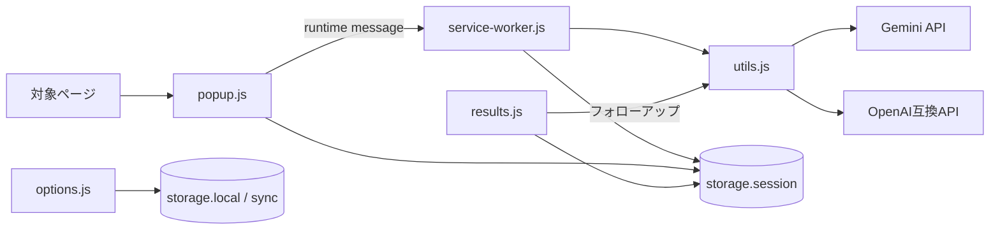

# 段階的テスト導入計画

<!-- markdownlint-disable MD024 -->

> **参考用のフルバージョン。** 個人開発で実際に導入・維持する範囲は、
> [`TESTING_PLAN_PERSONAL.md`](./TESTING_PLAN_PERSONAL.md) を正とする。
> 本書は、必要性が生じたときに追加できるテスト施策のカタログとして残す。

## 1. 目的

この文書は、現在 `npm run lint` のみで検証している本拡張機能へ、自動テストと手動テストを段階的に導入するための計画を定める。

目標は単純なテスト件数やカバレッジ率の増加ではなく、次の状態を実現することである。

- Gemini API と OpenAI 互換 API の双方について、主要な処理を変更しても回帰を検出できる
- non-streaming と streaming の双方を決定論的に検証できる
- popup、service worker、results、options、および storage 間の連携を検証できる
- Manifest V3 service worker 固有の問題を実ブラウザーで検証できる
- 実 LLM API に過度に依存せず、高速で安定したテストを日常的に実行できる
- Chrome、Edge、Firefox の差異を考慮したリリース判定ができる
- 既存機能を保護しながら、テストしやすいコード構造へ少しずつ移行できる

本計画では、一度に大規模なリファクタリングを行わない。最初に現在の挙動をテストで固定し、その安全網の内側で小さな構造改善を進める。

---

## 2. 現状と前提

### 2.1 現在の検証

現時点の `package.json` には `npm run lint` のみが定義されている。テストランナー、DOM テスト環境、Chrome API の fake、E2E テスト環境は未導入である。

lint は構文上・静的解析上の問題を検出できるが、次のような実行時の問題は保証しない。

- API へ送信する request body の誤り
- provider ごとに異なる response の解釈ミス
- streaming データがネットワーク chunk の途中で分割された場合の解析失敗
- 503 retry やモデル fallback の回数・条件の誤り
- `chrome.storage.session` の古い結果が混入する競合
- popup を閉じた後に結果が失われる問題
- Markdown 表示における XSS 対策の回帰
- options の保存・復元や optional host permission の誤り

### 2.2 主要な実行経路



特に、初回生成は `popup.js → service-worker.js → utils.js`、フォローアップは `results.js → utils.js` という異なる経路を通る。両方をテスト対象とする必要がある。

### 2.3 重要な制約

- Vanilla JavaScript の ES modules であり、TypeScript、フレームワーク、アプリケーション用バンドラーは使用しない
- `generateContent()` と `streamGenerateContent()` が LLM 呼び出しの共通入口である
- 本体コードは原則 `extension/` に置く
- `extension/lib/` は vendored library であり、直接編集しない
- Chrome は Manifest V3 service worker、Firefox は背景スクリプト定義を使用する
- 制御文には必ずブロック `{}` を使用する
- コード変更後は引き続き `npm run lint` を実行する

---

## 3. 基本方針

### 3.1 テストを複数の層に分ける

すべてを実ブラウザー E2E で確認するのではなく、目的に応じてテストを分担する。

| 層 | 主な目的 | 実行環境 | 数・頻度 |
| --- | --- | --- | --- |
| Unit | 小さな変換・判定・計算 | Vitest / Node.js | 最多、PR ごと |
| DOM component | UI の表示・入力・状態遷移 | Vitest + jsdom | 多い、PR ごと |
| Integration | モジュール、Chrome API、storage の連携 | Vitest + stateful fake | 中程度、PR ごと |
| Contract | LLM の request/response/stream 形式 | Vitest + fixture/mock | 多い、PR ごと |
| Browser E2E | 実 Chromium と MV3 の挙動 | Playwright | 少数、PR または main |
| Real API smoke | 上流 API への到達性と最低限の互換性 | 実 API | 少数、定期・リリース前 |
| Manual | ブラウザー UI・外部サイト・視覚確認 | 実機 | リリース前 |

### 3.2 通常の自動テストでは実 LLM API を呼ばない

通常の Unit、Integration、Contract、E2E では固定 fixture またはローカル mock server を使用する。実 API は料金、rate limit、ネットワーク、モデル更新、出力の揺らぎにより不安定になるため、日常的な合否判定には使わない。

### 3.3 現在の挙動を先に固定する

既存コードをテスト可能な構造へ変更する前に、characterization test を追加する。これは「理想的な仕様」ではなく「現在観測できる挙動」を固定するテストである。

疑わしい挙動を発見しても、次の順序を守る。

1. 現在の挙動をテストで再現する
2. テスト可能にするためのリファクタリングだけを行う
3. 挙動が変わっていないことを確認する
4. バグ修正は別の変更として行い、期待値を意図的に変更する

### 3.4 リファクタリングと仕様変更を混在させない

「関数を移動しながら動作も修正する」と、失敗原因を特定しにくい。原則として、構造変更と機能変更を別 PR または少なくとも別 commit に分離する。

### 3.5 カバレッジ率だけを目標にしない

行カバレッジは補助指標として利用するが、当初から一律の合格率は設定しない。代わりに、次の重要な組み合わせがテストされているかを管理する。

- Gemini / OpenAI
- streaming / non-streaming
- text / image
- success / API failure / internal failure
- single model retry / multiple model fallback
- popup 初回生成 / results フォローアップ
- fresh generation / cache hit

---

## 4. 採用ツール

### 4.1 Unit・DOM・Integration: Vitest

テストランナーには Vitest を採用する。

採用理由:

- ES modules と相性がよい
- `describe`、`it`、`expect` など学習資料の多い Jest 互換 API を使用できる
- mock、fake timer、coverage を一つの仕組みで扱える
- 本番の拡張機能をバンドルする必要がない
- watch mode により開発中の反復が速い

### 4.2 DOM 環境: jsdom

DOM を使うテストには jsdom を使用する。

ただし、jsdom は実ブラウザーそのものではなく、次の機能は完全には再現できない。

- canvas の実描画
- 画像の実デコード
- extension popup 固有の挙動
- permission dialog
- Manifest V3 service worker の停止・再起動

これらは関数の分離、stub、または Playwright・手動テストで補う。

### 4.3 Chromium E2E: Playwright

実ブラウザー E2E には Playwright を使用する。Chromium の persistent context に unpacked extension を読み込み、対象ページ、extension page、service worker を操作する。

注意点:

- Chrome 拡張機能の自動ロードは Chromium 系を中心に設計する
- Edge は Chromium として主要経路を共有できるが、リリース前に実 Edge で smoke test する
- Playwright の Firefox で Chrome/Firefox 拡張機能を同じ方法で読み込めるとは限らないため、Firefox 対応を Playwright だけで保証しない
- Firefox は静的 manifest テスト、Firefox Desktop の手動 smoke、必要に応じて将来 `web-ext` 等を用いた専用自動化を検討する

### 4.4 Chrome API: stateful fake

単に関数呼び出しを記録するだけでなく、状態を保持する fake をテスト用に用意する。

最初に必要な範囲:

- `chrome.storage.local/session/sync`
- `chrome.storage.onChanged`
- `chrome.runtime.sendMessage/onMessage`
- `chrome.runtime.getURL/getManifest`
- `chrome.i18n`

後続フェーズで追加する範囲:

- `chrome.tabs`
- `chrome.scripting`
- `chrome.permissions`
- `chrome.contextMenus`
- `chrome.commands`
- `chrome.action`

`storage.set()` が値を保存して `storage.onChanged` を発火するなど、本物の API に近い最小限の振る舞いを持たせる。

---

## 5. 推奨ディレクトリ構成

導入時には、概ね次の構成を想定する。実際の名称は初期導入時に最終決定する。

```text
test/
  unit/                    # 純粋関数、変換、判定
  dom/                     # popup/results/options/utils の DOM テスト
  integration/             # Chrome API fake を使う連携テスト
  contract/                # Gemini/OpenAI の通信契約
  fixtures/
    gemini/                # 固定 request/response/stream データ
    openai/
    pages/                 # Readability 等に使う固定 HTML
  helpers/
    chrome-fake.js
    fetch-mock.js
    dom-fixture.js
    stream-fixture.js

e2e/
  fixtures/                # E2E 用対象ページ
  mock-server/             # ローカル LLM mock server
  specs/                   # Playwright のテスト
```

本体にテスト専用分岐を大量に追加するのではなく、依存を注入できる小さな seam と、テスト側の helper で対応する。

---

## 6. 段階的導入計画

## Phase 0: ベースラインの記録

### 目的

テスト基盤導入前の状態を記録し、以後の変更が意図せず現在の動作を変えないようにする。

### 作業

1. 現在の `npm run lint` が成功する状態を確認する
2. Chrome で主要フローを手動実行し、最低限の結果を記録する
   - Gemini non-streaming
   - Gemini streaming
   - OpenAI non-streaming
   - OpenAI streaming
   - results ページのフォローアップ
   - options の保存・再表示
3. 現在の代表的な request/response を、秘密情報を除いて fixture 候補として記録する
4. API キー、Authorization header、個人情報を fixture やログへ保存しないことを確認する
5. 初期の手動チェックリストを作成する

### 完了条件

- lint が成功している
- 主要経路の現状が記録されている
- 秘密情報を含まない代表 fixture の候補が揃っている

---

## Phase 1: 最小テスト基盤と最初の Unit test

### 目的

本体コードへの変更を最小限にして、開発者が `npm test` で高速なテストを実行できる状態にする。

### 作業

1. Vitest と jsdom を開発用依存として追加する
2. テスト用設定を追加する
3. ESLint がテストファイルの Node/Vitest globals を正しく認識するよう設定する
4. package scripts を追加する
   - 1 回実行するテスト
   - watch mode
   - 必要に応じて coverage
5. 既に export されている関数から Unit test を追加する

最初の対象:

- `normalizeBaseUrl()`
- `getModelConfigs()`
- `getResponseContent()`

### 代表ケース

#### `normalizeBaseUrl()`

- 前後の空白
- trailing slash
- path 付き URL
- query/hash
- `http` / `https`
- port
- 不正 URL

#### `getModelConfigs()`

- Gemini の既定モデル
- thinking level
- thinking budget の `0`、`-1`
- auto fallback の複数モデル
- OpenAI の reasoning effort / thinking type

#### `getResponseContent()`

- Gemini 正常応答
- thought part を含む応答
- prompt block / response block
- OpenAI 正常応答
- finish reason 異常
- custom error code 1000～1004
- 想定外の body

### 完了条件

- `npm test` 相当のコマンドでテストを一括実行できる
- watch mode を利用できる
- lint とテストがともに成功する
- 最初のテストで本体の実質的な挙動を変更していない

---

## Phase 2: LLM 境界の characterization / contract test

### 目的

本プロジェクトで最も回帰リスクが高い LLM provider 層を、実 API なしで決定論的に検証する。

### 作業

1. `fetch` を固定応答へ差し替えるテスト helper を作る
2. Gemini/OpenAI の request と response fixture を作る
3. non-streaming の request/response 契約をテストする
4. streaming parser に任意の chunk 分割を与える helper を作る
5. fake timer または注入した sleep を使い、retry を実時間待機なしで検証する
6. API キーや Authorization header がテスト出力へ漏れないことを確認する

### Gemini の必須ケース

- endpoint と model ID
- `x-goog-api-key`
- `contents[].role/parts`
- `systemInstruction`
- `inline_data`
- `generationConfig.thinkingConfig`
- 正常応答
- thought part
- prompt block
- response block
- HTTP 429 / 503
- streaming JSON 配列
- stream 末尾の error
- JSON が複数 chunk に分割される場合

### OpenAI 互換 API の必須ケース

- Base URL の正規化
- `/chat/completions`
- Bearer header
- `system/user/assistant` への変換
- text content
- multimodal `image_url`
- `reasoning_effort`
- `thinking.type`
- 正常応答と異常な `finish_reason`
- SSE の複数 event
- SSE 行や JSON が chunk 途中で分割される場合
- `[DONE]`
- malformed event
- HTTP error body が JSON でない場合

### retry / fallback の必須ケース

- 単独モデルで 503 のみを規定回数再試行する
- 規定の backoff 順序になる
- 成功した時点で再試行を終了する
- 非 503 エラーでは不要な再試行をしない
- 複数モデルでは 429/503 で次モデルへ移る
- retry 状態が成功・終了後に削除される
- streaming と non-streaming の両方で同じ方針になる

### 必要に応じた本体の小さな変更

公開 API の契約を維持しながら、内部で次を差し替え可能にする。

- `fetch`
- `sleep`
- stream content writer
- retry status reporter

依存注入が本番呼び出し側へ広く伝播しないよう、既定値または内部 dependency object を利用する。

### 完了条件

- Gemini/OpenAI の双方で request と response の主要契約が固定されている
- streaming の chunk 境界を変えたテストがある
- retry/fallback を実時間待機なしで検証できる
- 通常テストから実 API を呼ばない

---

## Phase 3: セキュリティと共通 UI helper の DOM test

### 目的

DOM 操作と Markdown 表示の回帰を検出する。特に LLM 出力を HTML 表示する境界を優先する。

### 作業

1. jsdom 上で `utils.js` の UI helper を検証する
2. `marked` と DOMPurify のテスト用ロード方法を定める
3. XSS payload の固定回帰セットを作る
4. theme、font size、loading 表示をテストする
5. template 読み込みの成功・失敗をテストする

### `convertMarkdownToHtml()` の必須ケース

- 通常の heading、list、code block
- `<script>`
- `javascript:` URL
- `onerror` / `onclick`
- SVG 系 payload
- links 有効時の `target="_blank"`
- `rel="noopener noreferrer"`
- links 無効時のリンク除去
- code block 内の `<`、`>`、`&`
- malformed Markdown

### 注意事項

- vendored library 自体の網羅的テストは行わない
- 本プロジェクトが library をどのように設定・後処理しているかをテストする
- jsdom と実ブラウザーの差があり得るため、代表ケースは後続の E2E でも 1 件確認する

### 完了条件

- 既知 XSS payload が sanitize される
- リンク属性と code block の期待動作が固定されている
- 共通 UI helper の主要状態がテストされている

---

## Phase 4: 純粋ロジックの抽出と Unit test 拡大

### 目的

DOM や Chrome API に埋もれている重要ロジックを、挙動を変えずにテスト可能にする。

### 抽出候補

`utils.js` から:

- OpenAI 形式への変換
- system instruction の分離
- API URL 組み立て
- JSON の防御的解析
- retryable status 判定

`results.js` から:

- conversation 検証
- parts からの text/image 抽出
- image size 計算
- response success 判定

`service-worker.js` から:

- system prompt の組み立て
- 設定値から prompt 入力を作る処理

`popup.js` から:

- selection 有無と trigger action による action 決定
- result index と storage key の生成

### 進め方

抽出単位ごとに次を行う。

1. 可能なら抽出前に characterization test を追加する
2. 副作用のない関数として移動または export する
3. 既存呼び出し側を新しい関数へ置き換える
4. 同じ入力に対する出力が変わらないことを確認する
5. lint と全テストを実行する

### 完了条件

- 高価値な private logic を DOM 全体の初期化なしでテストできる
- 本番の公開 LLM entry point は維持されている
- リファクタリング中に仕様変更を混在させていない

---

## Phase 5: Chrome API fake と Integration test

### 目的

popup、service worker、results、options が Chrome API と storage を介して連携する処理を、実ブラウザーより高速に検証する。

### 先に行う小さな構造改善

#### service worker handler の分離

巨大な匿名 `runtime.onMessage` listener から、request を処理して結果を返す名前付き関数を分離する。実際の listener 登録は薄い adapter として残し、非同期 response のための `return true` という契約を維持する。

#### UI 初期化の明示化

モジュール import 直後の DOM 参照・listener 登録を、必要に応じて初期化関数へまとめる。本番では従来どおり一度呼び出し、テストでは fixture 構築後に呼び出せるようにする。二重登録を防止する。

#### storage key 操作の集約

次のキー生成を一箇所へ集約することを検討する。

- `result_<index>`
- `conversation_<index>`
- `streamContent_<index>`
- `retryStatus_<index>`
- `autoSavePending_<index>`

### Integration シナリオ

1. popup → runtime message → service worker → mocked fetch → session result
2. streaming content の storage 更新 → popup/results の中間表示
3. retry status 更新 → loading 文言の変更
4. 成功時だけ response cache を追加
5. result index が循環しても古い result/conversation/stream を混入させない
6. results を先に開き、後から結果が届く
7. follow-up → conversation 保存 → 再初期化で復元
8. error/blocked response を conversation へ保存しない
9. options 保存 → cache 削除 → context menu 再構築
10. OpenAI Base URL 変更 → permission 判定
11. storage write failure、message failure の扱い
12. auto-save pending を一度だけ消費

### 完了条件

- 主要な storage/message 連携を実ブラウザーなしで再現できる
- テスト間で fake の状態を確実にリセットできる
- timer と storage event の待機に固定 sleep を使っていない
- 初回生成とフォローアップの双方がカバーされている

---

## Phase 6: popup・results・options の DOM component test

### 目的

各画面のユーザー操作と状態遷移を検証する。

### popup

- template 読み込み後の select 生成
- provider によるモデル表示切り替え
- loading / streaming / success / error 表示
- cache hit 時に生成 request を送らない
- Run again では cache を使わない
- copy / save
- results page link
- always open results in tab

### results

- 保存済み結果の表示
- 結果未到着時の waiting 状態
- 結果到着後の title 状態
- conversation の正常・異常データ
- follow-up の送信可否
- Ctrl/Cmd+Enter
- IME composition 中は送信しない
- 画像の file/paste/drop/解除
- 古い画像正規化処理が新しい選択を上書きしない
- clear conversation
- auto-save handoff

### options

- provider section の切り替え
- 全設定の form → storage → form round-trip
- import の部分更新規則
- malformed JSON
- API key を含む/含まない export
- host permission が必要な Base URL
- permission 拒否時の UI
- 保存時の cache 削除

### 画像処理の扱い

- 縦横比と最大辺の計算は純粋関数として Unit test する
- FileReader、Image、canvas の流れは stub を使った component test を行う
- 実際の画像 decode、canvas 再エンコード、品質・サイズは Chromium E2E と手動テストで少数確認する

### 完了条件

- 主要画面状態を固定 HTML fixture 上で再現できる
- 画面テストで実ネットワークや実 Chrome API を使用しない
- 各テストが独立し、実行順序へ依存しない

---

## Phase 7: 静的整合性テスト

### 目的

実行時テストでは見落としやすい、リポジトリ全体の機械的な不整合を低コストで検出する。

### 対象

#### manifest

- `extension/manifest.json` と `firefox/manifest.json` の version 一致
- 共通項目の一致
- Chrome に `background.service_worker` がある
- Firefox に `background.scripts` と Gecko ID がある
- manifest から参照するファイルが存在する
- `default_locale` が存在する

#### locale

- 英語 locale を基準に全 locale のキーが一致する
- `message` フィールドが存在する
- manifest で参照する `__MSG_*__` キーが存在する
- 意図しない空文字がない

#### HTML / JavaScript の契約

- JavaScript が取得する主要 element ID が対応 HTML に存在する
- 重複 ID がない
- module script の参照先が存在する

### 完了条件

- version や locale key の更新漏れを PR で検出できる
- ファイル参照切れを拡張機能ロード前に検出できる

---

## Phase 8: Chromium Playwright E2E

### 目的

Vitest と fake では保証できない、実 Chromium、unpacked extension、Manifest V3 service worker を含む主要ユーザージャーニーを検証する。

### E2E 環境

- isolated temporary user data directory
- unpacked extension として `extension/` をロード
- API はローカル mock server を使用
- テスト対象 Web ページもローカル fixture server から提供
- API キーは実値ではなくダミー値
- テストごとに storage と tab 状態を初期化

### 最初の E2E シナリオ

1. fixture ページを開く
2. テキストを選択する
3. popup を開く
4. 要約を実行する
5. mock OpenAI endpoint が固定応答を返す
6. 結果表示を確認する
7. results page を開く
8. follow-up を送信する
9. conversation を確認する
10. results page を再読み込みし、conversation の復元を確認する

OpenAI 互換 API を最初の E2E に使う理由は、Base URL をローカル mock server へ向けやすいためである。Gemini 固有 wire contract は Vitest の contract test で先に十分検証する。

### 追加 E2E シナリオ

- streaming の途中表示と完了
- 選択なし → Readability 抽出
- Readability 失敗 → capture fallback
- always open results in tab
- popup を閉じた後も結果が保存される
- results page を先に開いて結果を待つ
- service worker の停止・再起動後に保存済み状態を利用する
- 複数 result index と stale data の排除
- 画像付き follow-up
- options 保存と再読み込み
- optional host permission の許可経路

### E2E で避けること

- 全分岐の網羅
- 実 LLM API の呼び出し
- 固定秒数の sleep
- LLM 文章全体の完全一致
- 既に Unit test で十分保証できる単純な入力組み合わせの重複

### 成果物

失敗調査を容易にするため、CI では必要に応じて次を artifact として保存する。

- screenshot
- trace
- console log
- mock server の request log（秘密情報を除去）

### 完了条件

- 少なくとも 1 本の主要ユーザージャーニーが Chromium で安定して動作する
- retry による再実行を含めても固定 sleep を使わない
- service worker と extension page のエラーをテスト失敗として把握できる

---

## Phase 9: Real API smoke test

### 目的

mock では検出できない上流 API の認証、到達性、最低限の schema 互換性を確認する。

### 実行頻度

- PR の必須チェックにはしない
- 手動起動、nightly、またはリリース前に限定する
- secret が利用可能な保護された CI 環境でのみ実行する
- fork 由来の PR では実行しない

### 最小ケース

1. Gemini non-streaming
2. Gemini streaming
3. 代表 OpenAI 互換 API non-streaming
4. 代表 OpenAI 互換 API streaming

### 合否条件

- 認証と HTTP request が成功する
- 空でない本文を取得できる
- stream が正常終了する
- 想定時間内に完了する
- response の最低限の形を処理できる
- secret が出力・artifact・例外へ露出しない

### 合否条件にしないもの

- 生成文章の完全一致
- 文体
- 要約の主観的品質
- 503 を意図的に起こすこと

retry、blocked response、malformed response は mock test で検証する。

### 完了条件

- 実 API の変動が通常の PR 開発を妨げない
- upstream の破壊的変更を定期的に検出できる

---

## Phase 10: クロスブラウザー手動テストとリリース運用

### 目的

自動化が難しいブラウザー固有挙動、OS 連携、外部サイト依存をリリース前に確認する。

### Chrome Desktop

- unpacked/packaged extension のインストール
- popup、results、options
- context menu
- keyboard shortcuts
- optional host permission
- clipboard、download
- browser restart 後の context menu
- service worker 停止後の再実行

### Edge Desktop

- インストール
- popup、results、options の基本フロー
- permission、context menu、shortcut

### Firefox Desktop

- Firefox manifest からのロード
- background module の起動
- popup、results、options
- `storage.session`
- optional host permission
- context menu と commands

### Firefox Android

- popup の基本フロー
- `commands` が利用できない環境で初期化に失敗しない
- `contextMenus` が利用できない環境で初期化に失敗しない
- results page の表示と操作

### 外部サイト・視覚確認

- 実 YouTube 字幕の取得
- Readability が成功する一般記事
- Readability fallback が必要なページ
- RTL locale
- mobile layout
- 大きな画像
- PDF/画像ページの要約
- clipboard permission 拒否
- download ファイル名と内容

### 完了条件

- リリースチェックリストに実施者、ブラウザー version、結果を記録する
- 失敗項目を既知問題として明示するか、リリース前に解決する

---

## 7. 優先順位

### P0: 最優先

1. Gemini/OpenAI の request 変換と response 解釈
2. streaming parser の chunk 境界
3. 503 retry とモデル fallback
4. Markdown sanitization と XSS
5. `storage.session` を介した result/stream/retry の連携
6. manifest version と参照ファイルの整合性

### P1: 高優先度

1. service worker message handler
2. conversation 保存・復元
3. options 保存/import/export/permission
4. popup の入力抽出と action 分岐
5. 画像 normalize と非同期競合
6. Chromium の主要 E2E

### P2: 中優先度

- locale key 整合性
- title の waiting/unread 状態
- IME、clipboard、download
- RTL、mobile layout、accessibility
- Firefox Desktop/Android の自動化拡大

---

## 8. CI の段階的構成

### 初期

PR 必須:

1. lint
2. Unit test
3. LLM contract test
4. 静的整合性テスト

### Integration 導入後

PR 必須:

1. lint
2. Unit test
3. DOM component test
4. Integration test
5. Contract test
6. 静的整合性テスト

### E2E 導入後

PR 必須:

- 上記すべて
- 最小 Chromium E2E

main/nightly:

- Chromium E2E 全体
- 実行時間の長い画像・service worker シナリオ
- 必要に応じて Firefox 専用 smoke automation

定期・リリース前:

- Real API smoke
- クロスブラウザー手動チェックリスト

### 推奨 package scripts の役割

具体的な名称は導入時に決定するが、次の用途を分離する。

- `lint`: 静的解析
- `test`: 高速な Vitest 一括実行
- `test:watch`: ローカル開発用
- `test:coverage`: coverage レポート
- `test:e2e`: Playwright
- `test:all`: lint と主要自動テストの一括実行

---

## 9. テストデータと秘密情報

### fixture の原則

- 小さく、目的が一つだけ分かるデータにする
- 実際の API response を使う場合も不要な部分を削る
- 正常系だけでなく malformed、partial、error fixture を用意する
- stream は chunk の配列として表現し、境界を明示する
- fixture の意図をテスト名またはコメントで説明する

### 保存禁止情報

- 実 API key
- `Authorization` header
- 個人情報を含む Web ページ本文
- 個人の conversation
- 非公開 URL

request log を保存する場合は header を除外またはマスクする。

---

## 10. flaky test を防ぐ規則

1. 固定時間の sleep を使用しない
2. fake timer、event、condition、Playwright の自動待機を使用する
3. テスト間で storage、DOM、mock、module state をリセットする
4. 実行順序に依存させない
5. 実 API や外部 Web サイトを通常テストから呼ばない
6. 日時、乱数、tab ID が必要なら注入または固定する
7. async 操作を未 await のまま残さない
8. E2E では test ごとに一時 user profile を分離する
9. flaky なテストを無期限に retry で隠さない
10. 失敗を再現できない場合は trace、fixture、ログを改善する

---

## 11. 本体コードをテストしやすくする際の規則

### 推奨する変更

- 純粋関数の抽出
- `fetch`、sleep、storage writer の小さな依存注入
- 匿名 message handler の名前付き関数化
- event listener 登録の明示的初期化
- storage key の集約
- DOM renderer の出力先 element を引数にする

### 避ける変更

- テストだけのための本番グローバル変数
- `if (isTest)` のような本番コード内の大規模分岐
- 全 DOM API を独自 wrapper で包む過剰設計
- 拡張機能本体への新しいフレームワーク導入
- 本番ファイルをテスト都合でバンドルすること
- 複数ファイルの大規模移動と仕様変更を同時に行うこと

---

## 12. 各変更に対する Definition of Done

テスト関連または本体変更の完了条件を次のようにする。

1. 関連する自動テストが追加・更新されている
2. Gemini/OpenAI の影響範囲を確認している
3. streaming/non-streaming の影響範囲を確認している
4. `npm run lint` が成功する
5. 該当する Vitest が成功する
6. E2E 対象の場合は Playwright が成功する
7. API key や Authorization がログ・fixture に含まれない
8. 新しい flaky 要因として固定 sleep や外部ネットワーク依存を追加していない
9. リファクタリングと仕様変更が混在していない、または混在理由が明記されている
10. 必要な手動確認項目が記録されている

---

## 13. 導入単位の推奨

一度にすべて実装せず、次の小さな変更単位に分ける。

1. **PR 1: Vitest + jsdom と最初の Unit test**
2. **PR 2: Gemini/OpenAI non-streaming contract test**
3. **PR 3: streaming fixture と parser test**
4. **PR 4: retry/fallback の fake timer test と必要最小限の seam**
5. **PR 5: Markdown/XSS DOM test**
6. **PR 6: manifest・locale 静的整合性テスト**
7. **PR 7: 純粋ロジック抽出と Unit test 拡大**
8. **PR 8: stateful Chrome API fake**
9. **PR 9: service worker handler 分離と Integration test**
10. **PR 10: popup/results/options の component test**
11. **PR 11: Playwright 最小 E2E とローカル mock server**
12. **PR 12 以降: E2E、Firefox、real API smoke、手動チェックリストの拡充**

各 PR はレビュー可能な大きさに保ち、前段のテストを安全網として次段へ進む。

---

## 14. 最終的に目指す状態

日常開発では、開発者が短時間で lint、Unit、DOM、Integration、Contract test を実行できる。主要な PR では Chromium E2E が動き、リリース前には real API smoke とブラウザー別手動チェックリストを実施する。

最終的な品質保証は一つのテスト手法に依存せず、次の組み合わせで構成する。

- 純粋ロジックは高速な Unit test
- UI 状態は jsdom component test
- Chrome API と storage の連携は stateful fake による Integration test
- API 形式と streaming は Contract test
- MV3 と主要ユーザージャーニーは Chromium Playwright E2E
- upstream 到達性は少数の Real API smoke
- ブラウザー固有 UI と外部サイト依存はリリース前 Manual test

この順序で導入することで、既存機能を一度に作り直すことなく、回帰を検出できる範囲を段階的に拡大する。
